# Annotating and Drawing in PDF Files

> _Librera_ supports basic annotation and drawing markup tools in PDF documents.

> NB! **These tools work only in SCROLL Mode**

To make a PDF document suitable for drawing and/or annotating, the user should switch to Scroll Mode.  
This will reveal the _Edit_ icon on the bottom menu.

## PDF Files without a Text Layer
- Handwritten notes
- Freehand drawings (a stylus is highly recommended)
- Blotting out text, pictures, credit card info, etc.
- Erasing previous markings
> Tip: Lock the "lock" in bottom right corner to prevent lateral movements!

||||
|-|-|-|
|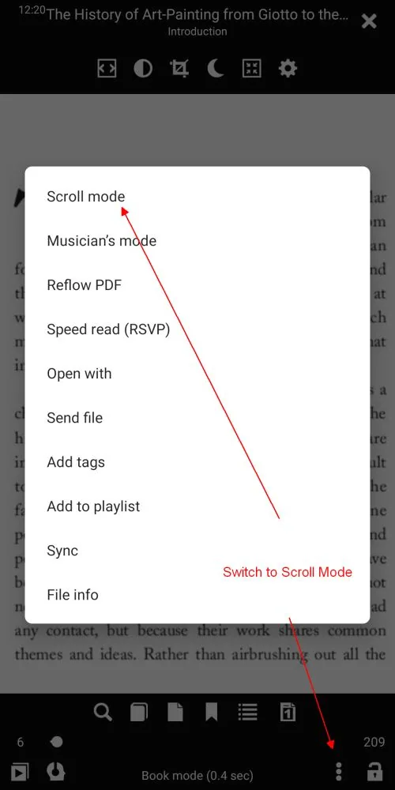{: loading="lazy"}|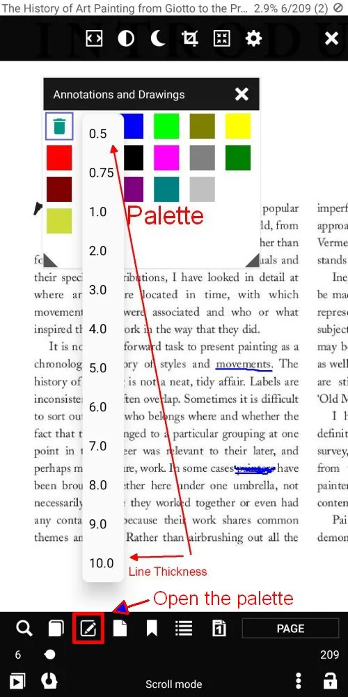{: loading="lazy"}|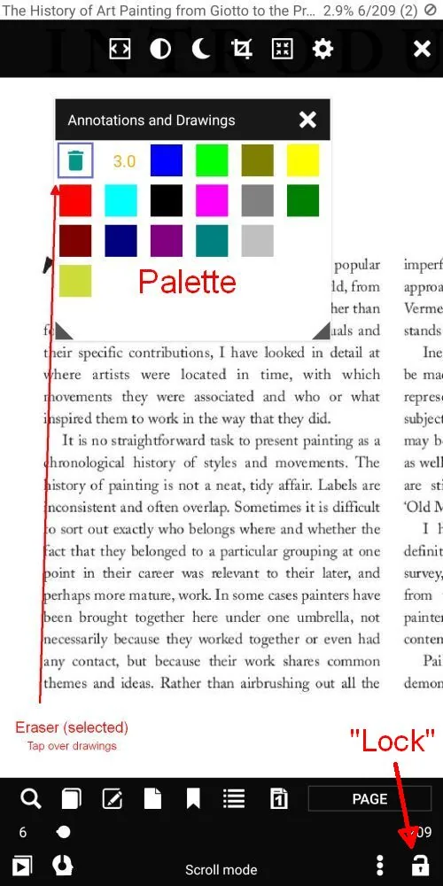{: loading="lazy"}|

## PDF Files with a Text Layer
In addition to the above markings:
- Text highlighting
- Underlining
- Striking through
> Tip: Just select a word (with a long-press) to open the toolset

|||
|-|-|
|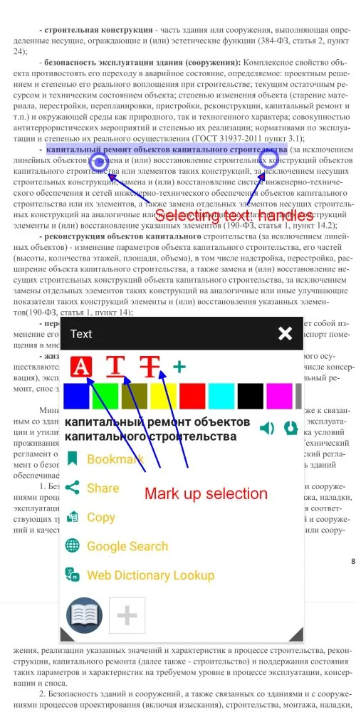{: loading="lazy"}|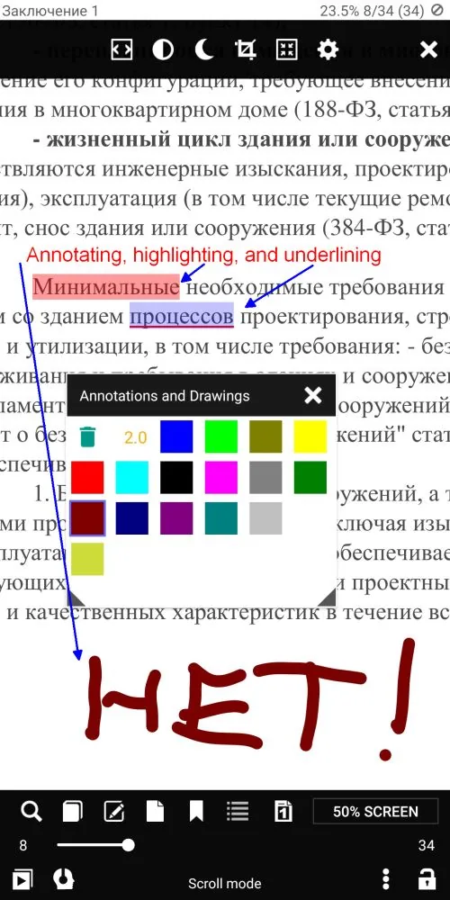{: loading="lazy"}|

## Marking Up with Preset Tools
The **+** sign allows the user to add to the list of tools just one of the three in the currently chosen color.  
This creates a tool preset with which you can promptly indicate the words and word sequences related to each other or deserving your special attention (like the name _Girault_ in the example below)

|||
|-|-|
|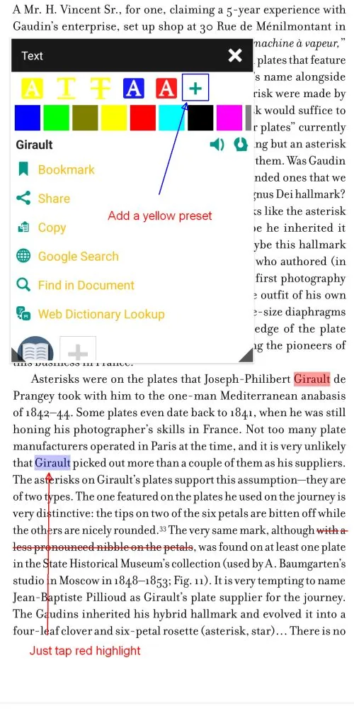{: loading="lazy"}|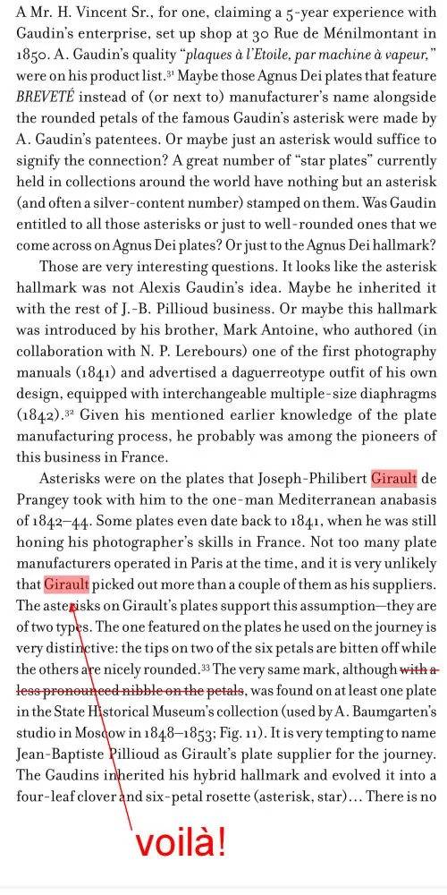{: loading="lazy"}|

## Saving Edited Files
* A _Close_ gesture will open the _Save changes?_ window
* You can save your changed file by tapping _YES_
* You can save changes to a new, renamed file. Tap _RENAME_
* Edit filename at the bottom of the _Choose_ window, and tap _SELECT_

|||
|-|-|
|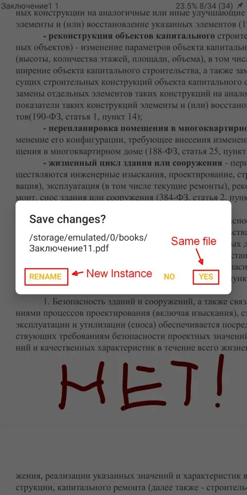{: loading="lazy"}|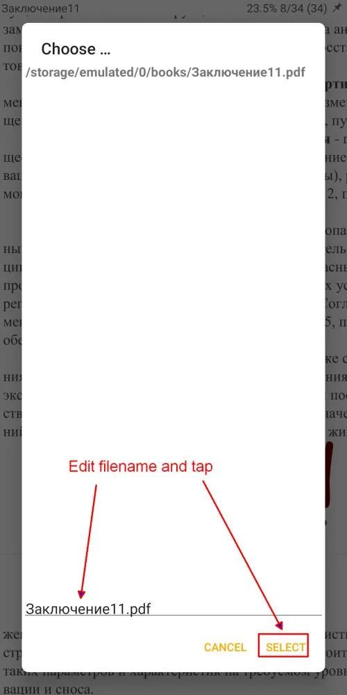{: loading="lazy"}|

> Note: The Eraser in the _Annotations and Drawings_ palette can be used to nuke drawings left by other applications.

> You can invoke the palette by:
- Tapping on a marking
- Tapping on the _Edit_ icon on the bottom menu

> Select the _Eraser_ (Waste Bin) by tapping on it, and then tap on the markings you're about to remove.

|||
|-|-|
|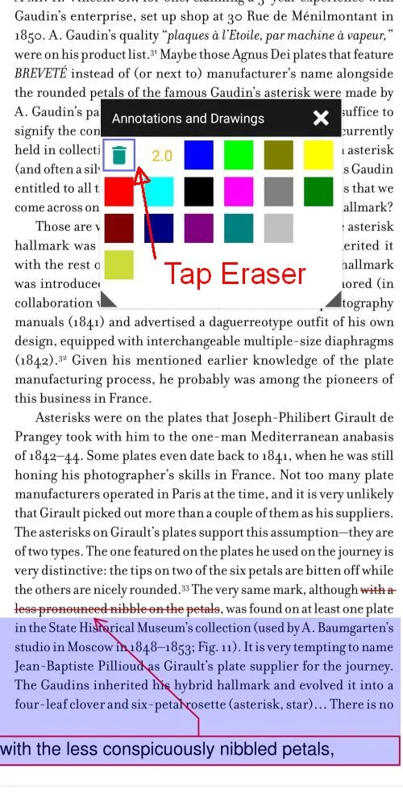{: loading="lazy"}|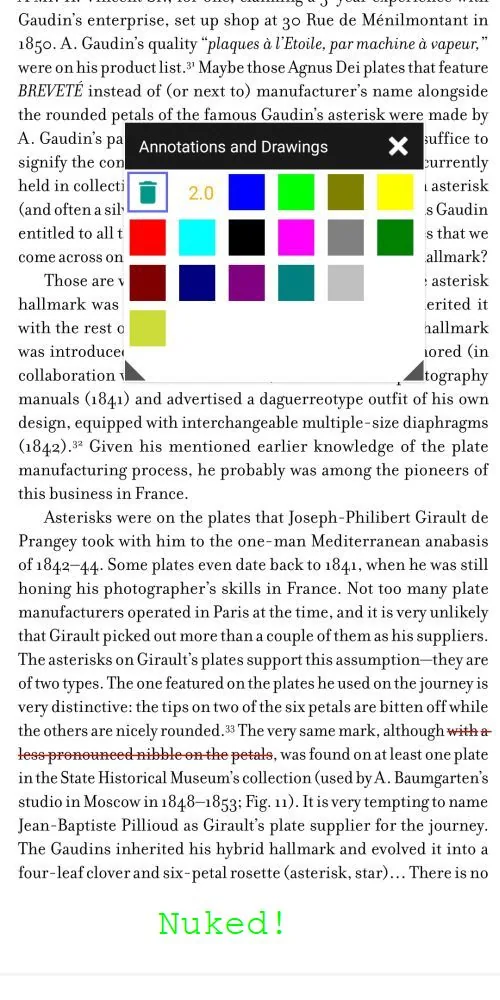{: loading="lazy"}|
