# Theming Librera's UI

> **Librera** allows you to customize every single detail of the user interface.

In the _General Settings_ panel of the **Preferences** tab you can choose your personal:

* Font size
* Theme motif and color
* Trimming color
* Link color

||||
|-|-|-|
|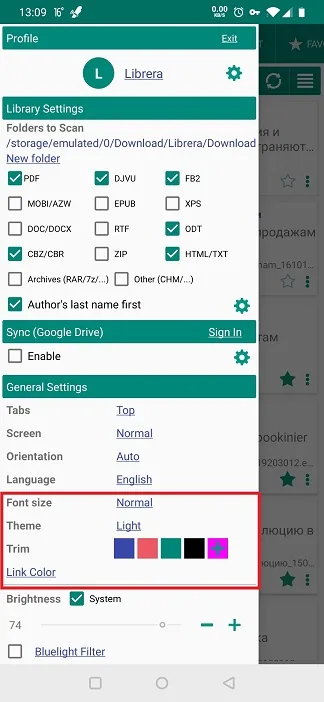{: loading="lazy"}|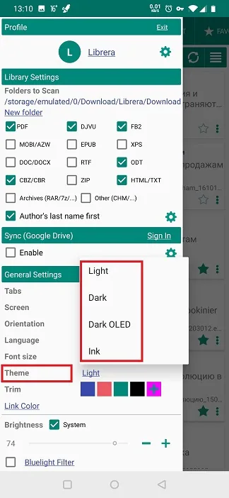{: loading="lazy"}|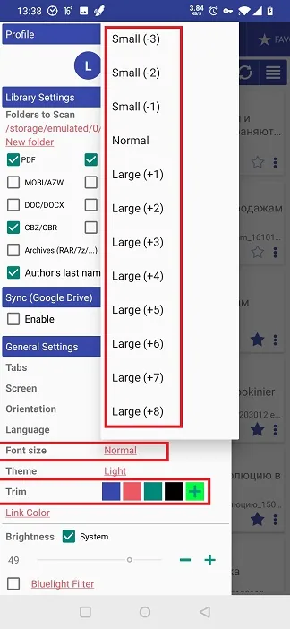{: loading="lazy"}|

**Font-Size Setting**

* Tap on _Font Size_ to open a dropdown list of relative font sizes
* Choose the font size by decreasing or increasing your current font-size

||||
|-|-|-|
|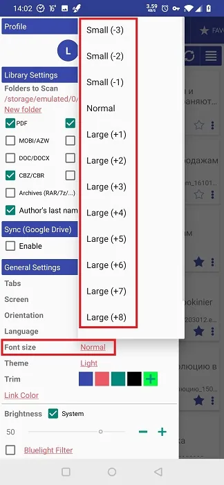{: loading="lazy"}|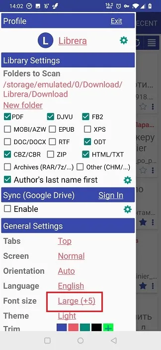{: loading="lazy"}|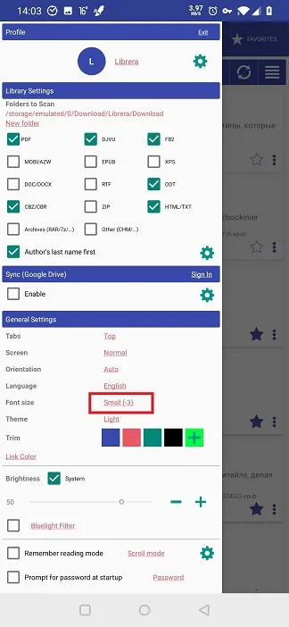{: loading="lazy"}|

**General Theme Setting**

* Tap on _Theme_ to open a dropdown list of available themes
* Select the theme you want. You can also choose the theme for E-Ink screens.

> _Some extra theming will come from your choice of colors and fonts while setting up your Day/Night reading modes_

||||
|-|-|-|
|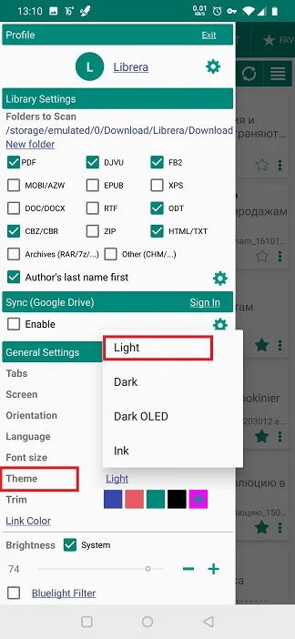{: loading="lazy"}|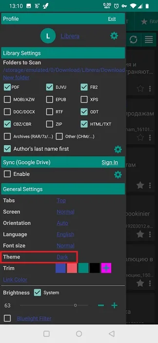{: loading="lazy"}|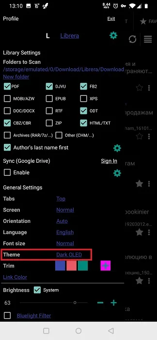{: loading="lazy"}|

**Header and Title Color (Trim) Setting**

* You can select one of the available presets by tapping on it
* Or you can choose something entirely different by tapping on **+**
* Select your color from the opened color palette

||||
|-|-|-|
|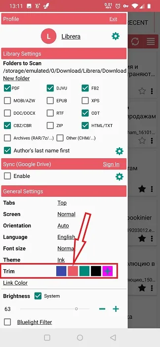{: loading="lazy"}|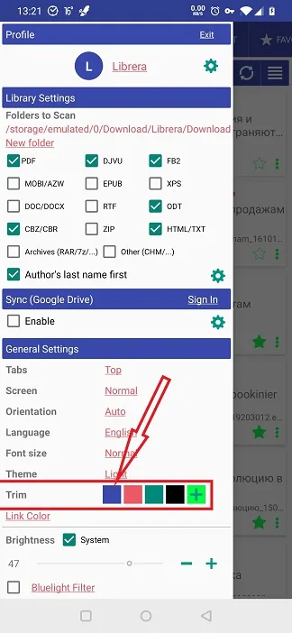{: loading="lazy"}|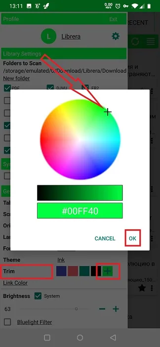{: loading="lazy"}|

**Link Color Setting**

* You need to _Enable_ custom colors by overriding the system settings
* Select one of the available presets by tapping on it
* Or you can choose something entirely different by tapping on **+**
* Select your color from the opened color palette

||||
|-|-|-|
|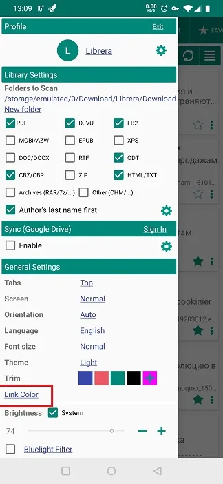{: loading="lazy"}|{: loading="lazy"}|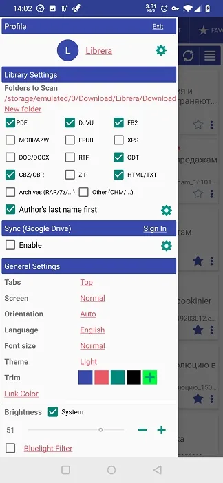{: loading="lazy"}|

> **The best thing offered by *Librera* is the ability to theme each profile you create in it individually. You can theme your profiles created for your mood changes, day and night reading, book genres, etc.**
