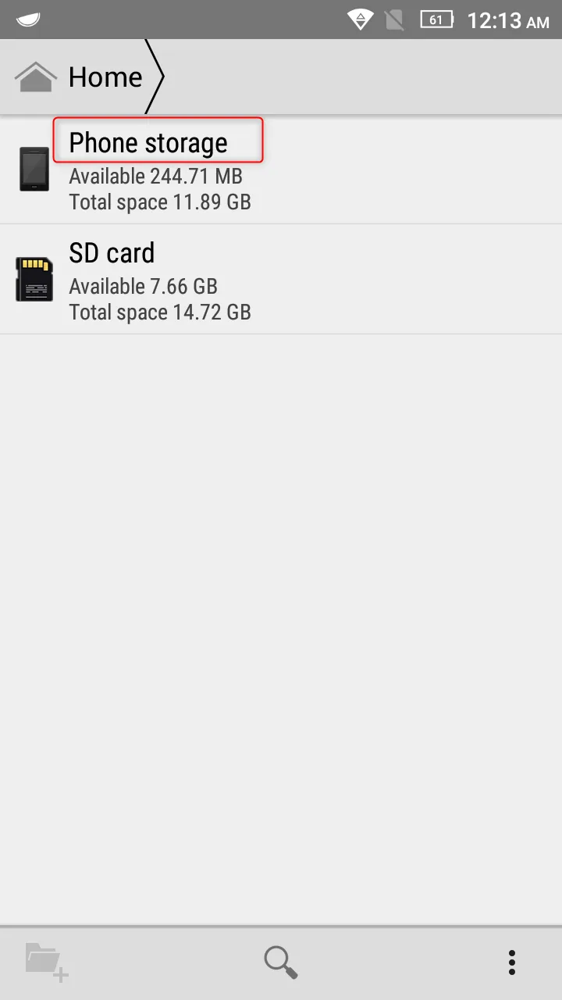
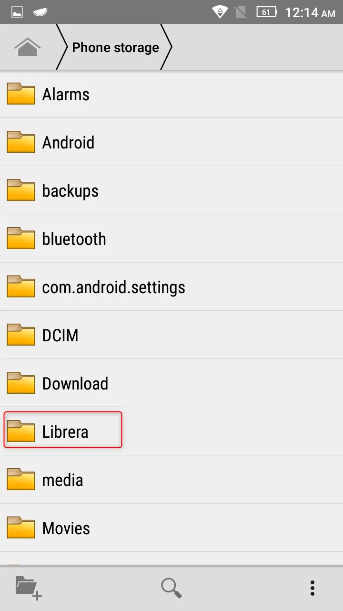
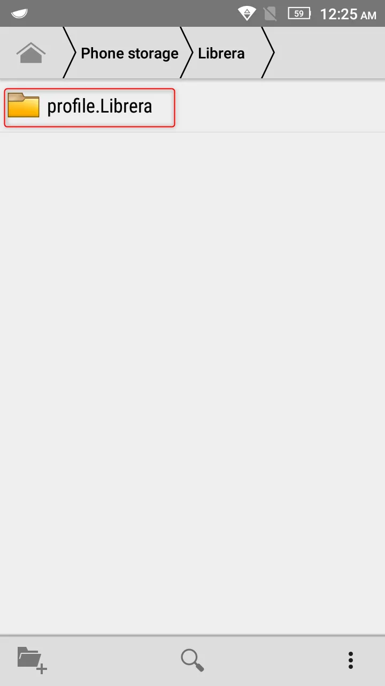
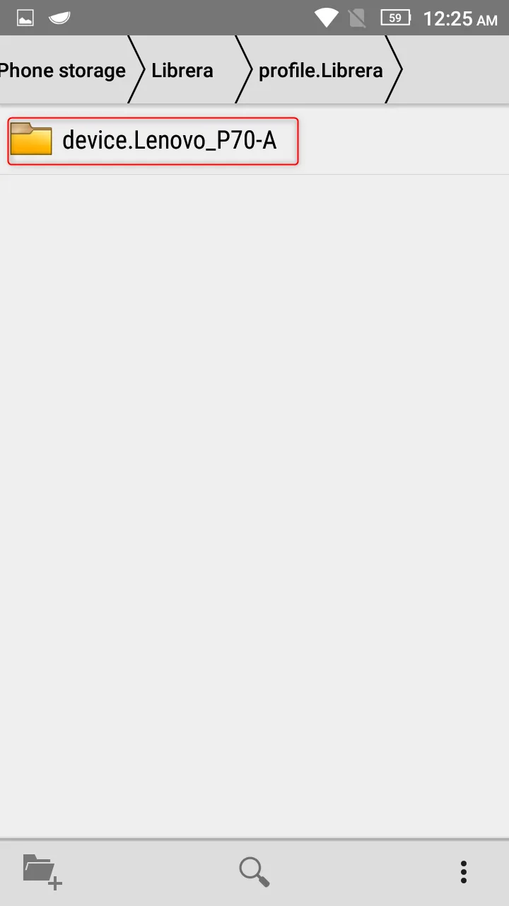
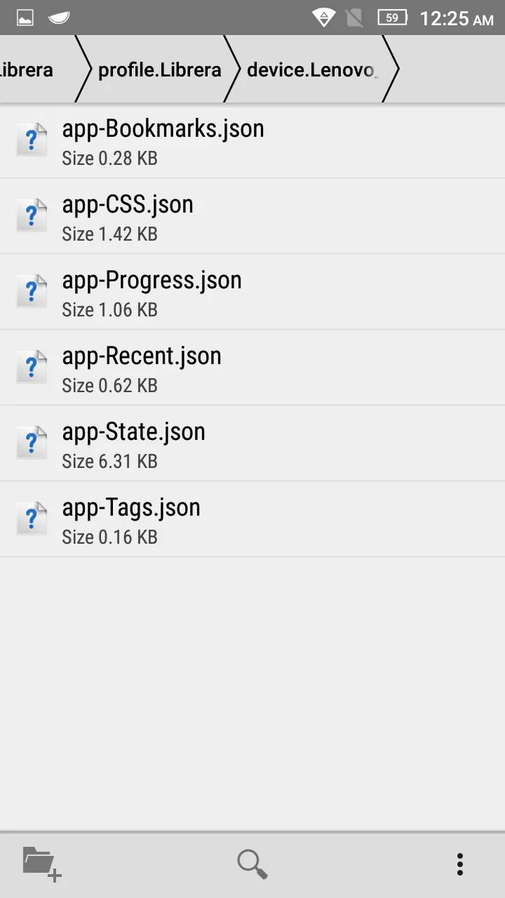

# Delete and reset all Librera settings

> In order to delete the application settings manually, you need to open the file manager and go to this path - 
> **Phone storage/Librera/profile.Librera/device._name of your device_** and delete all files from the folder.

1. Select phone memory
2. Find the Librera folder
3. Open the folder profile.Librera - this folder contains folders with profiles
4. Open folder "device._your device name_"

If you created your profile, you need to select the folder with your profile. 
If you did not create a profile, the _device.name of your device_ package is created by default

5. Delete files

||||
|-|-|-|
|{: loading="lazy"}|{: loading="lazy"}|{: loading="lazy"}|
|{: loading="lazy"}|{: loading="lazy"}||

* app-Bookmarks.json - bookmarks
* app-CSS.json – styles and book markup
* app-Progress.json – reading progress
* app-Recent.json – list of read books
* app-State.json – general application settings
* app-Tags.json – book tags
