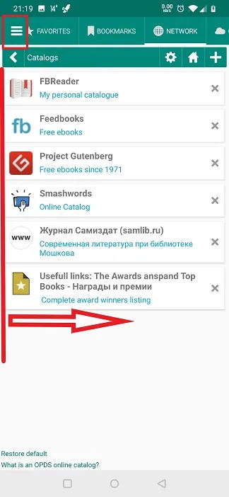
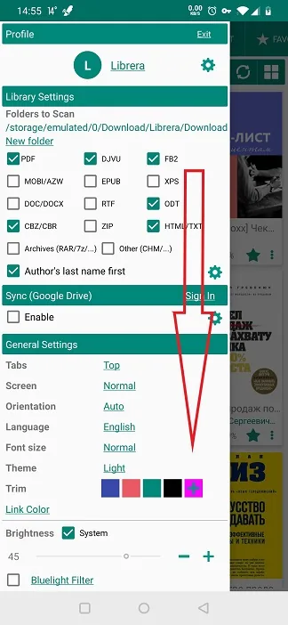
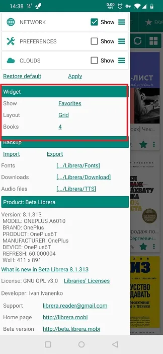
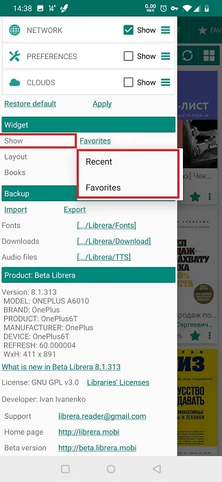
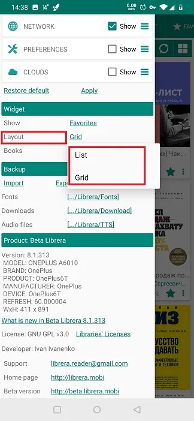
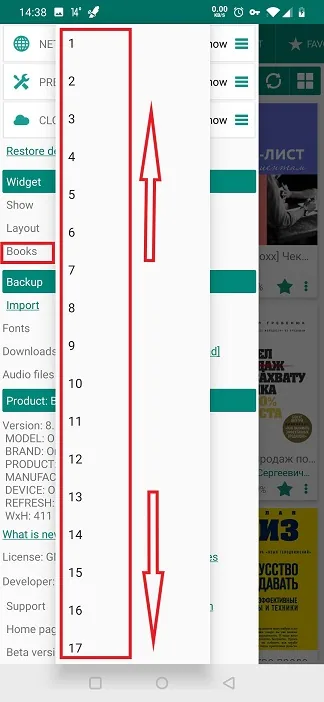

# Using _Librera_'s Widget

> The widget will help you launch **Librera** right from the desktop of your device. And with the book of your choosing. 

To start using **Librera**'s widget, you should place it on the desktop via the _Widgets_ tab in your launcher.

||||
|-|-|-|
|{: loading="lazy"}|{: loading="lazy"}|{: loading="lazy"}|

## Customizing the Widget

* Open the slide-out **Preferences** tab and swipe down to the _Widget_ panel

||||
|-|-|-|
|{: loading="lazy"}|{: loading="lazy"}|{: loading="lazy"}|

* You can tell the widget what to display by choosing between your _Favorites_ and _Recent_ documents
* Select the layout for the books in **Librera**'s widget
* You can choose the size of **Librera**'s widget by increasing or decreasing the number of books on your widget's bookshelf

||||
|-|-|-|
|{: loading="lazy"}|{: loading="lazy"}|{: loading="lazy"}|
