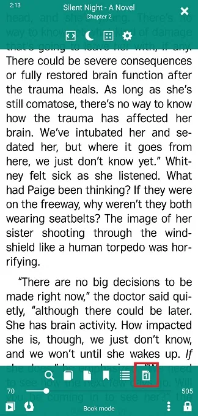
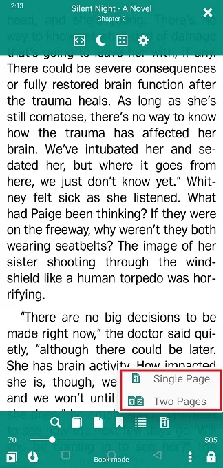
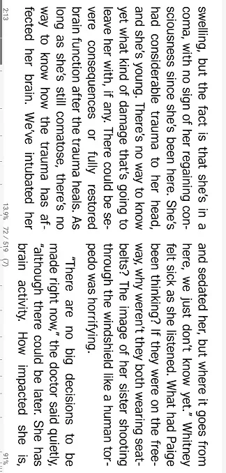
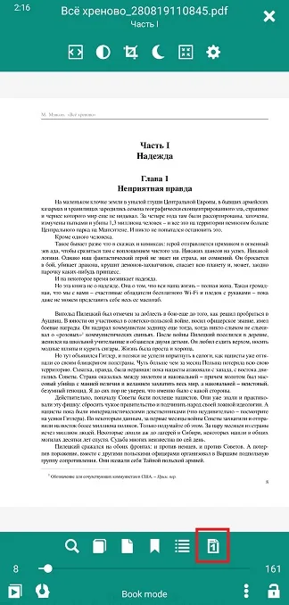
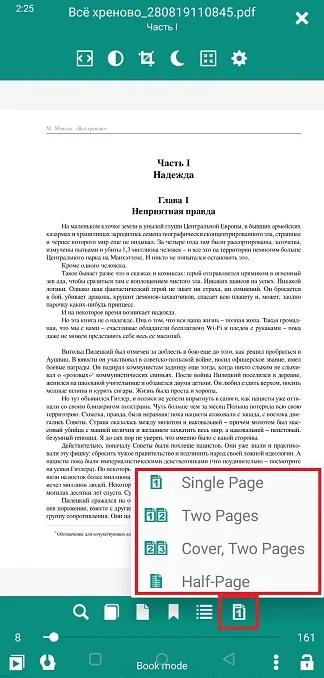
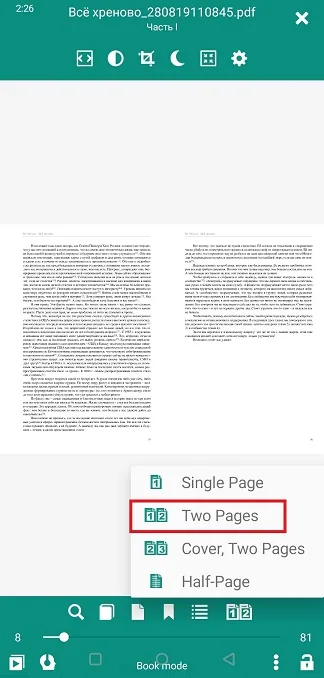
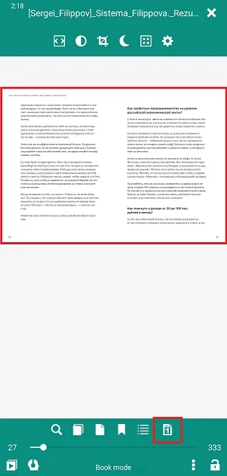
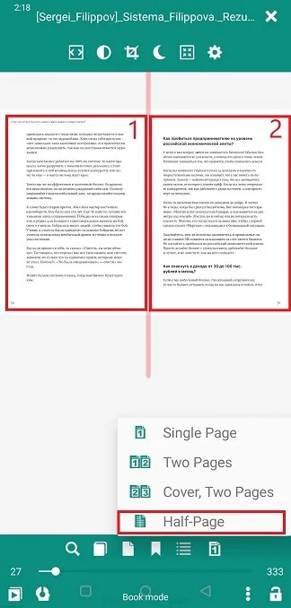
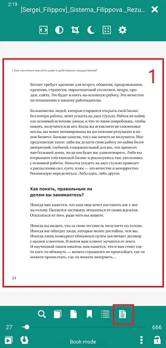

# Page Viewing/Layout Options

> To ensure comfortable reading, **Librera** allows the user to make adjustments to the page layout in all supported ebook formats. 

To access the viewing options:
* Center-tap your screen to open the menu
* Tap the layout icon at bottom right to open a dropdown list of options

## Adjusting Page Layout in EPUB, MOBI, FB2, AWZ, etc. 

* _Single Page_ layout is preferred for _Portrait_ screen orientation 
* If your screen orientation changes (automatically or manually) to _Landscape_, you can follow up with switching to the _Two Pages_ layout
* Switch back to _Single Page_ after rotating your device to _Portrait_ orientation

> **You can preset combinations of screen orientations and page layouts, and use those combinations profile-wise.**

||||
|-|-|-|
|{: loading="lazy"}|{: loading="lazy"}|{: loading="lazy"}|

## Adjusting Page Layout in PDF/DjVu

Page "rigidity" in PDF/DjVu and the size of your screen will dictate your page layout choices:
* _Single Page_ or _Two Pages_ mode for _Portrait_ orientation on large screens
* _Two Pages_ mode, preferred for large screens and _Landscape_ orientation
* Sometimes the cover page must be presented separately, especially if illustrations in your book run across spreads (choose _Cover, Two Pages_ in this case)

||||
|-|-|-|
|{: loading="lazy"}|{: loading="lazy"}|{: loading="lazy"}|

* _Half-Page_ mode comes in handy in two-column page layouts. Just split your page in two by choosing this option

||||
|-|-|-|
|{: loading="lazy"}|{: loading="lazy"}|{: loading="lazy"}|
