# Using *Librera* for Learning Foreign Languages

> *Librera Reader* is an excellent tool for those who learn a foreign language... or just happen to read a book in another tongue.

Just use your finger (any finger) to highlight/select text
* Translate easily and promptly a selected word, passage or even page
* Configure **Librera** to work with online and offline translators and/or dictionaries

||||
|-|-|-|
|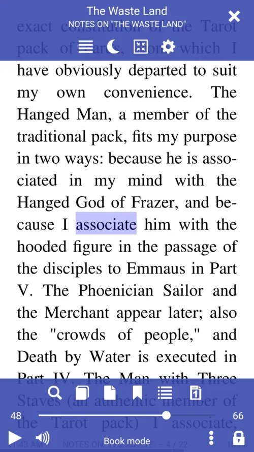{: loading="lazy"}|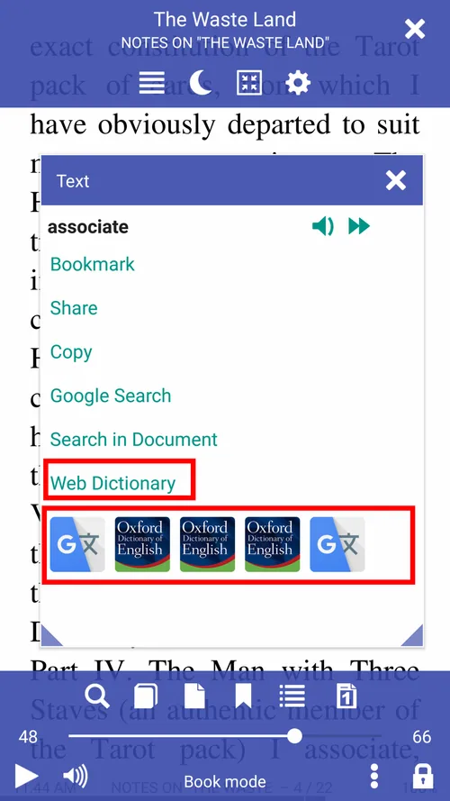{: loading="lazy"}|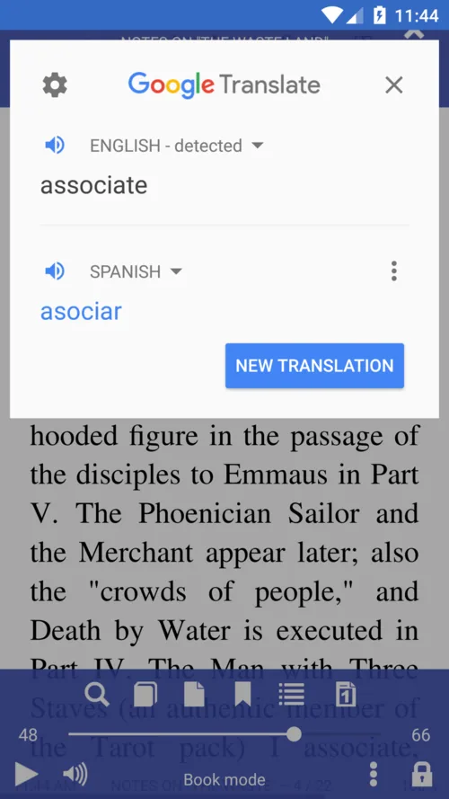{: loading="lazy"}|

* Enable single-touch (long-press) dictionary lookup (check the box)
* This also holds for passage translations if your "dictionary-of-choice" is, say, Google Translate (make sure your Internet connection is up and running)
> Note! You can configure **Librera** to select words on a single tap in the _Advanced Settings_ tab (not recommended)

||||
|-|-|-|
|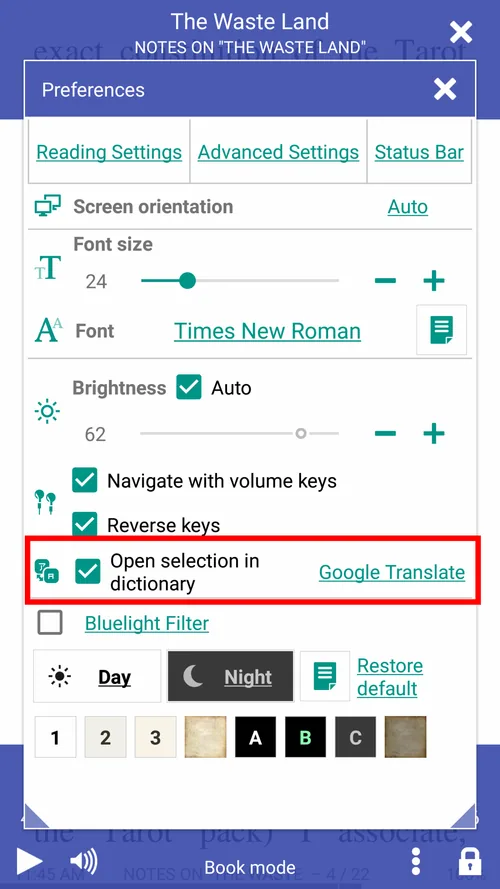{: loading="lazy"}|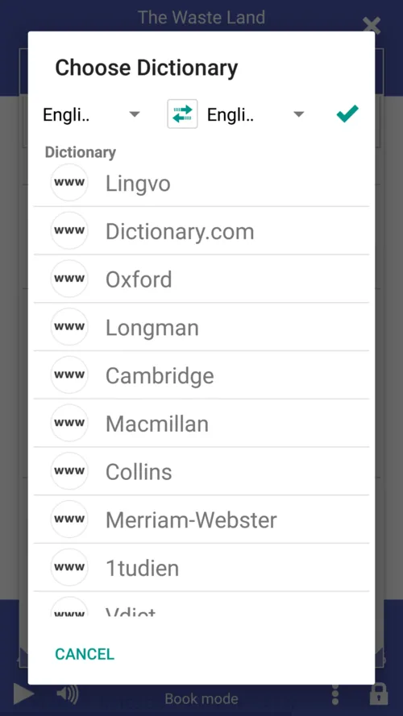{: loading="lazy"}|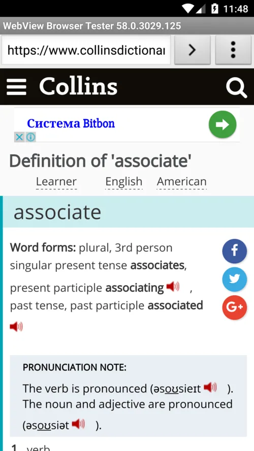{: loading="lazy"}|

If the _Open selection in dictionary_ is unchecked, you will be presented with multiple choices in the _Text_ window:
* Make **Librera** pronounce the word for you or read your selection back to you out loud
* Make it read the entire book out loud (voice-accompanied reading)
* Open the word/passage in another dictionary/translator
* Bookmark pages with meaningful word sequences

||||
|-|-|-|
|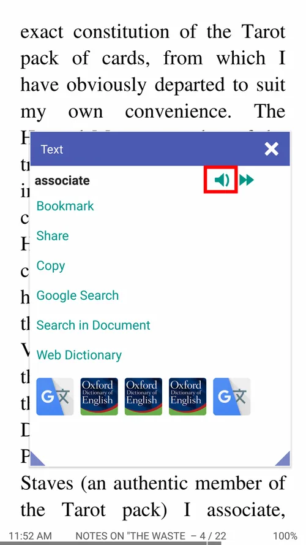{: loading="lazy"}|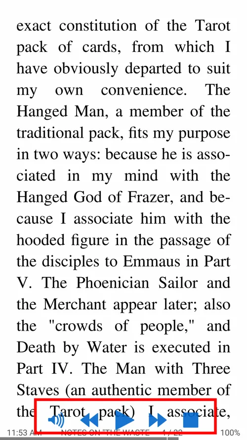{: loading="lazy"}|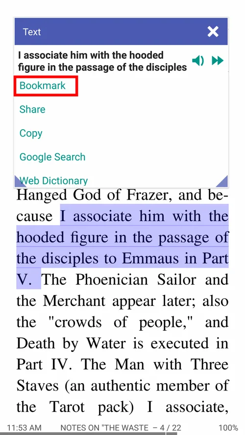{: loading="lazy"}|

> You can play external audio files with **Librera**. It supports all frequently used audio formats, e.g., .mp3, .mp4, .wav, .ogg, .m4a, and .flac.
* Play audio-books alongside their ebook copies (voice-accompanied reading)
* Handle the pace of your reading with the playback controls at the bottom
* Use the **Bookmarks** window to navigate the book

||||
|-|-|-|
|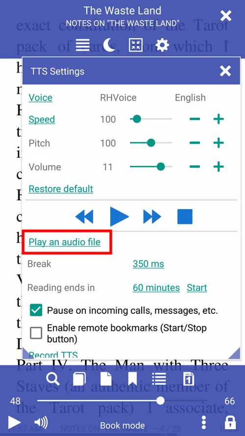{: loading="lazy"}|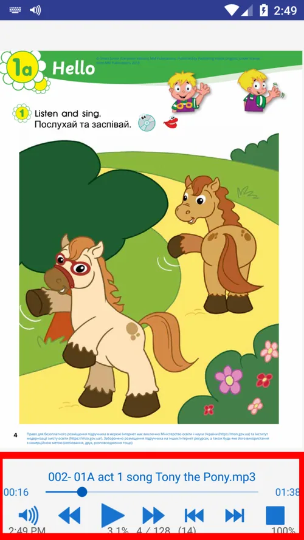{: loading="lazy"}|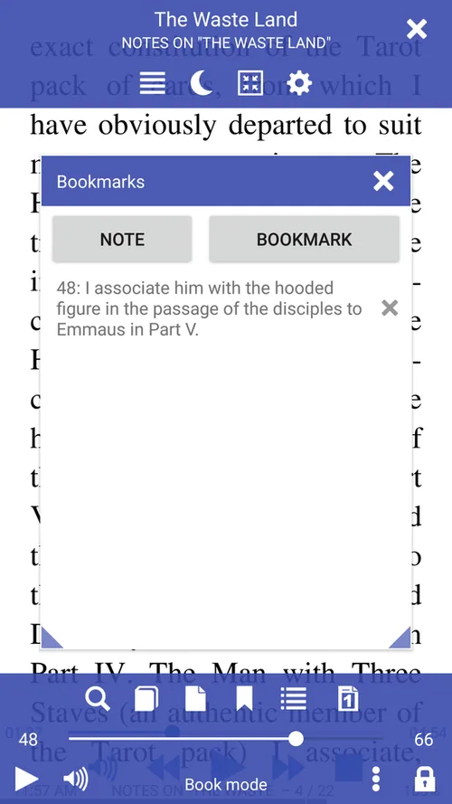{: loading="lazy"}|

> **A long-press on the Play/Pause button will rewind the track to the very beginning.**
