# Reading Modes: Scroll, Book, and Musician's

> **Librera** allows the reader to choose among three reading modes.  Each one addresses particular requirements and the user can switch from one mode to another quite easily.

In **Scroll mode**, book pages are scrolled up and down with finger swipes

> You can also enable auto-scroll and set up its speed.

In **Book mode**, pages are flipped horizontally with left-right or up-down finger swipes (or taps on the screen edges)

**Musician's mode** is a case of the auto-scroll mode specifically designed for musicians.

* A tap on a book will pop up the **Reading Mode** window for you to choose a reading mode for this book
* Check the _Remember reading mode_ box and select your default mode for all books
* You can edit the reading modes' names after tapping on _Edit_
* A long-press on _Edit_ will restore the default names

||||
|-|-|-|
|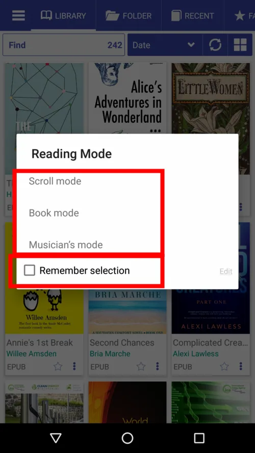{: loading="lazy"}|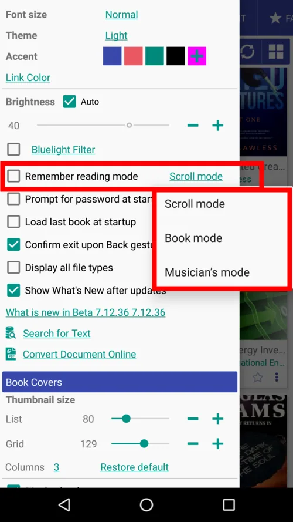{: loading="lazy"}|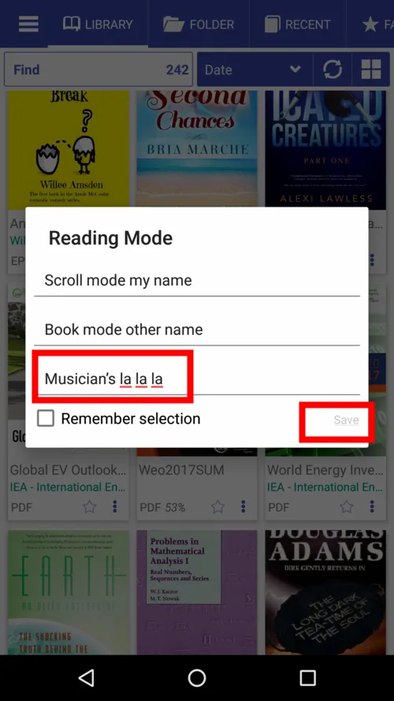{: loading="lazy"}|

**You can also specify default reading modes for each and every ebook format.**

* Tap on the settings icon to call out the presets dialog
* Check the box to enable presets and edit the lists if needed
* Don't forget to tap _SAVE_ if you've made changes
* You can restore the lists to defaults by tapping _Restore default_

||||
|-|-|-|
|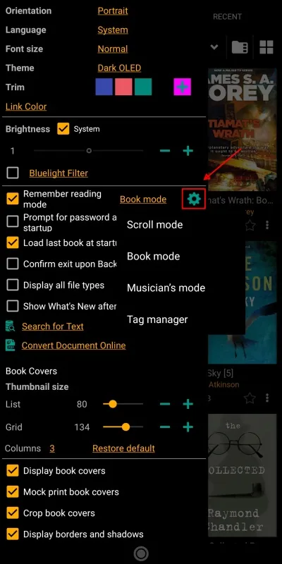{: loading="lazy"}|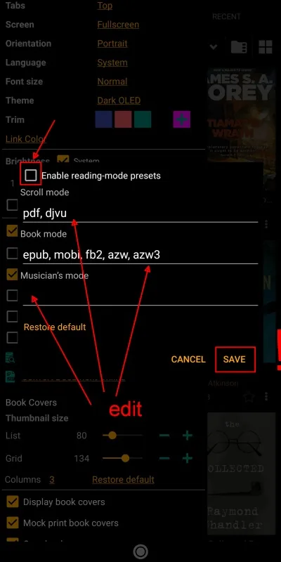{: loading="lazy"}|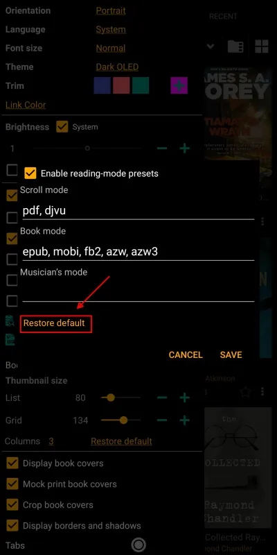{: loading="lazy"}|

* To change the reading mode for a current book, center-tap the screen and then tap on the triple-dot icon at the bottom
* Tap on the preferred mode in the dialog
* Voilà!

||||
|-|-|-|
|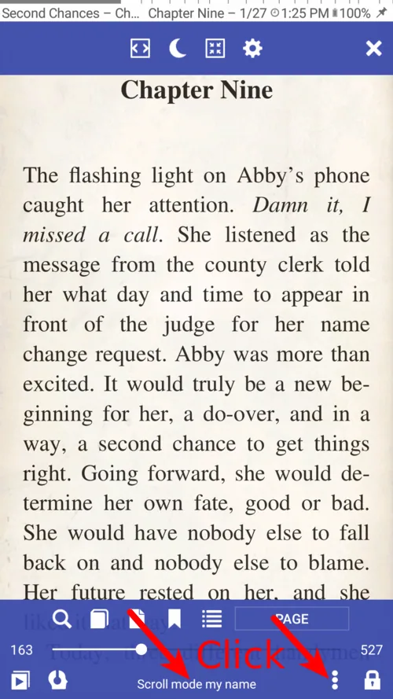{: loading="lazy"}|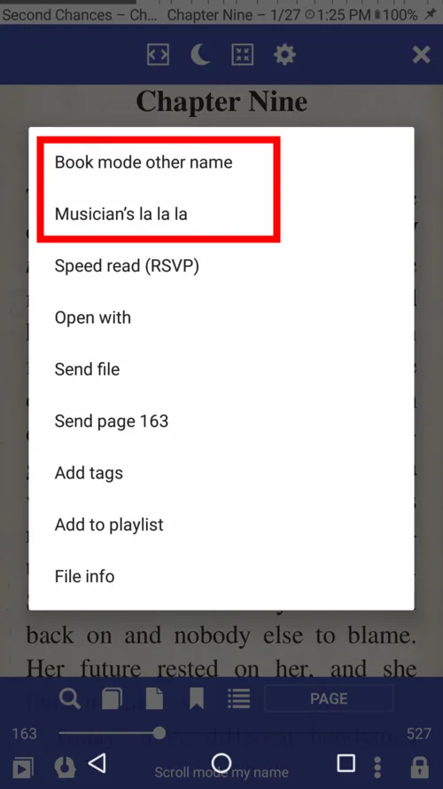{: loading="lazy"}|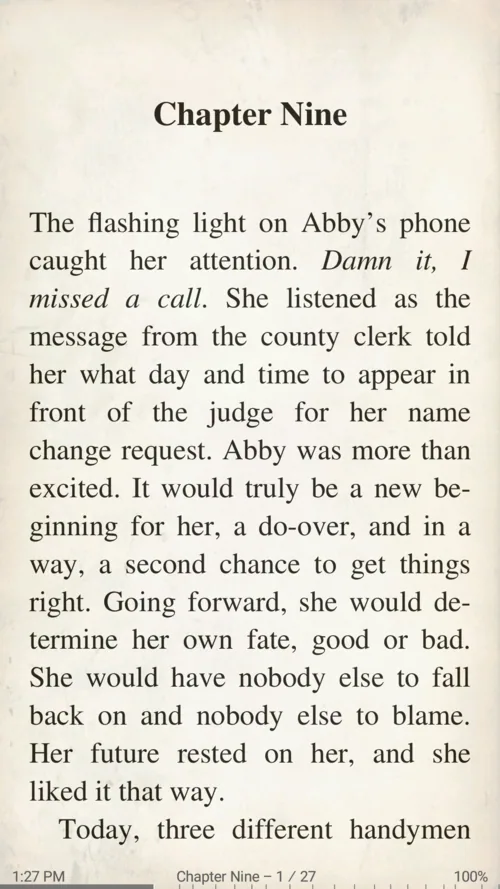{: loading="lazy"}|

## Scroll Mode
* Choose the gage of your scroll-swipes: by Page, Screen, screen percentage presets, or a custom value

> **Scroll with volume buttons, hardware keys, buttons on your bluetooth device, taps on the screen.**

||||
|-|-|-|
|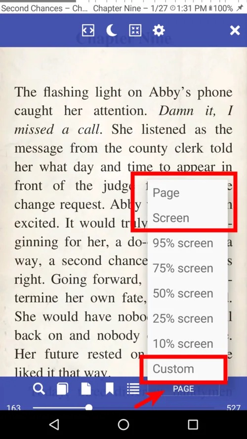{: loading="lazy"}|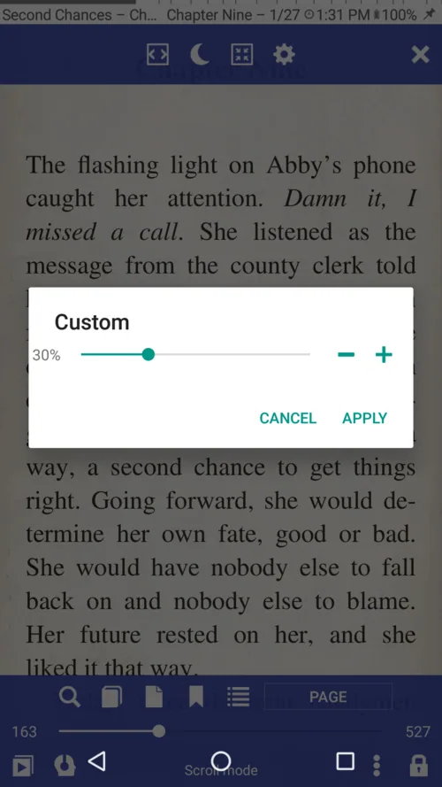{: loading="lazy"}|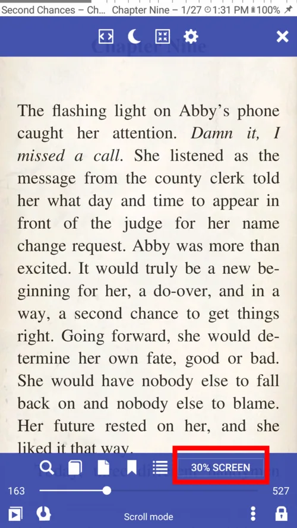{: loading="lazy"}|

## Book Mode
* Swipe horizontally for next/previous page
* Swipe vertically for next/previous page
* Change the response to your vertical swipes
> **Flip pages with volume buttons, hardware keys, buttons on your bluetooth device, or taps on the screen.**

**Just remember that your tap zones are customizable in terms of size and action!**

||||
|-|-|-|
|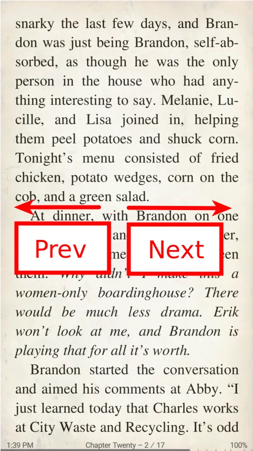{: loading="lazy"}|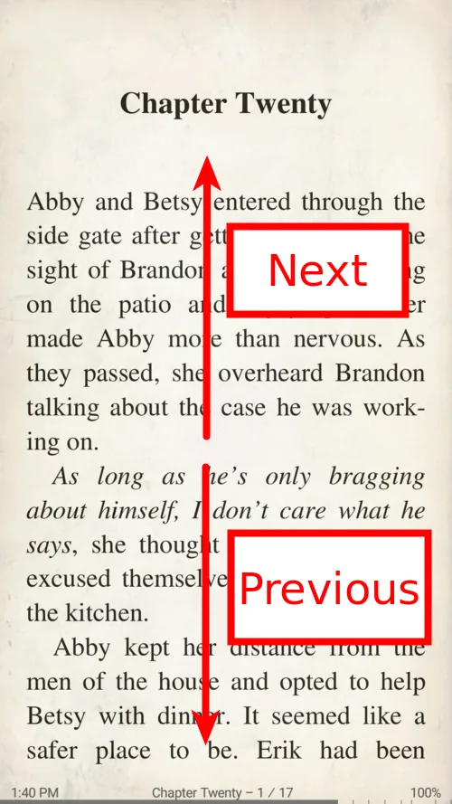{: loading="lazy"}|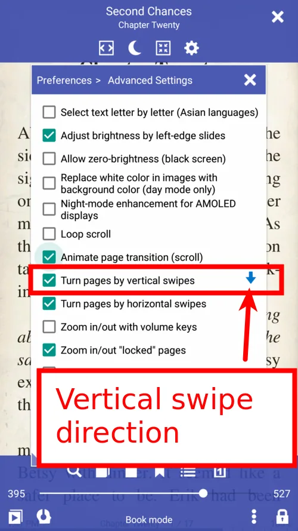{: loading="lazy"}|

## Musician's Mode
* Single-tap to start/stop auto-scroll
* Use taps in designated zones to go to next/previous page
* Change auto scroll speed on-the-fly
* Tap on the top to show the controls
* Tap on the rewind icon to go back to the beginning at any point in time

||||
|-|-|-|
|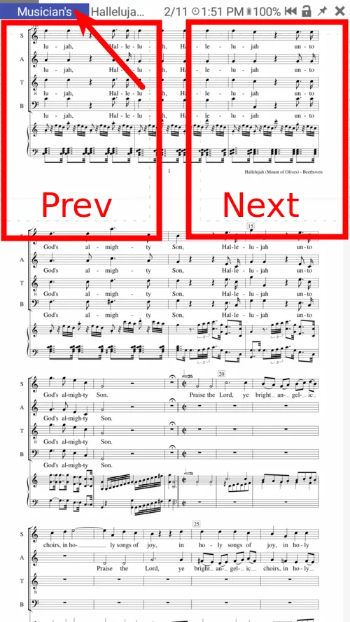{: loading="lazy"}|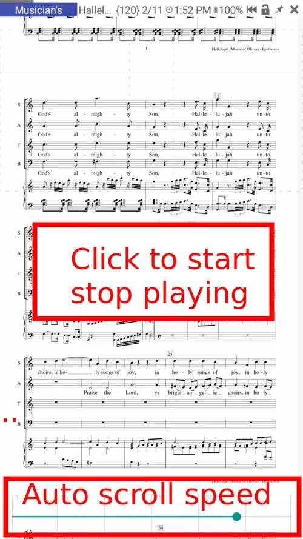{: loading="lazy"}|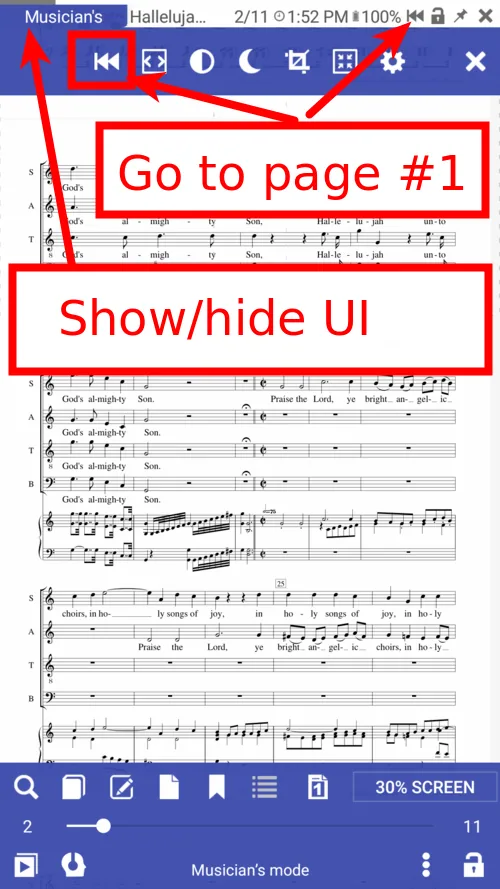{: loading="lazy"}|
