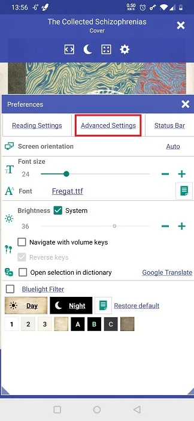
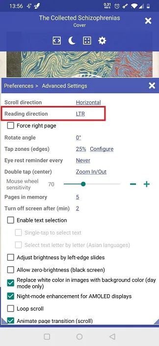
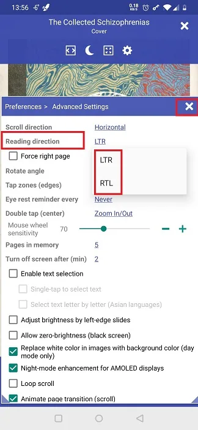
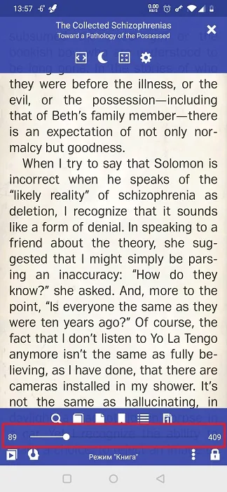
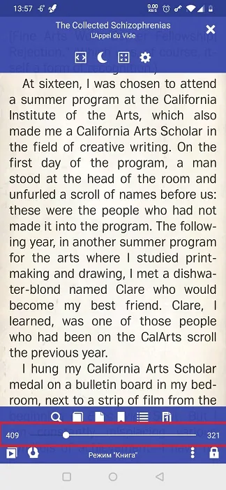

# Reading in RTL Languages

> **Librera** can be adapted quite easily for reading texts in left-to-right languages, e.g., Arabic, Hebrew, Farsi, or Urdu. You just need to change the reading direction from its default LTR setting.

To change the reading direction to RTL:

* Tap on the **Settings** icon to open the **Preferences** window
* Open the _Advanced Settings_ tab
* Tap on the _Reading direction_ link and select _RTL_
* To adjust two-page layouts for RTL reading, check the _Force right page_ box 

||||
|-|-|-|
|{: loading="lazy"}|{: loading="lazy"}|{: loading="lazy"}|

||||
|-|-|-|
|{: loading="lazy"}|{: loading="lazy"}|{: loading="lazy"}|
