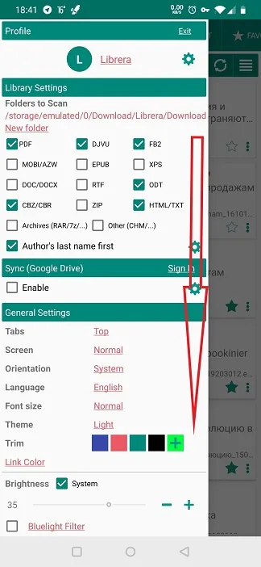
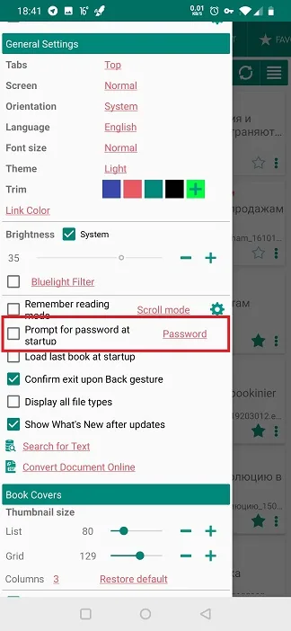
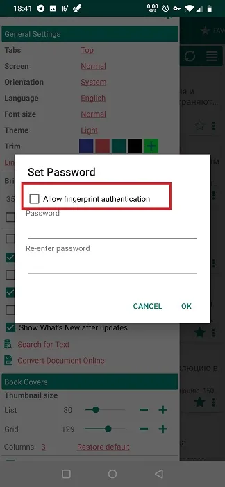
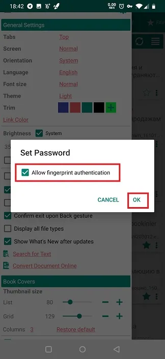
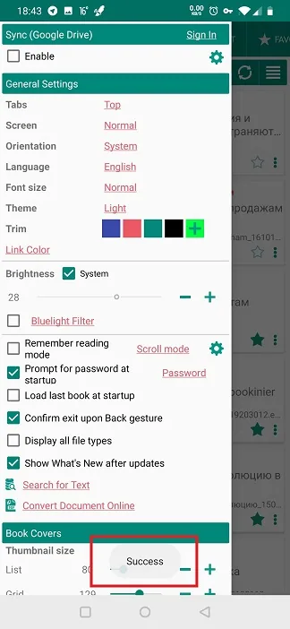
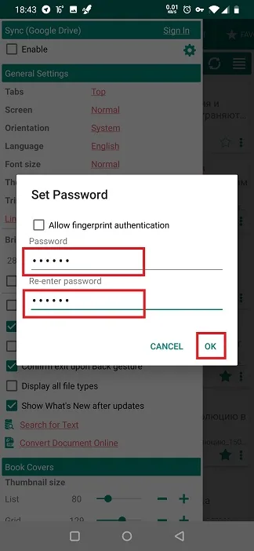
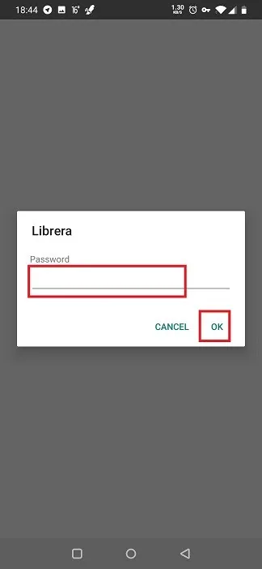
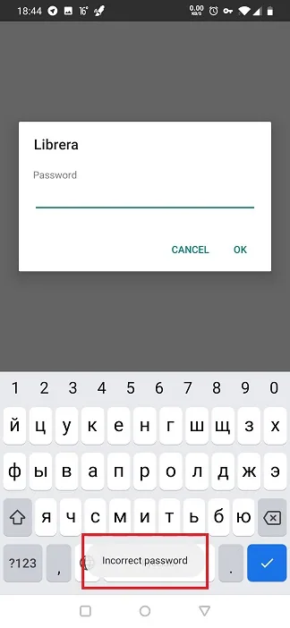

# Setting Up Fingerprint or Password Protection

> In **Librera**, you can protect your most sensitive documents from being viewed by unauthorized users who may accidentally or otherwise acquire access to your device. As a matter of fact, you will protect ALL your documents since you are restricting access to the app itself.
The documents can be either fingerprint- or password-protected.

## Enabling Startup Authorization

* Close the book you're currently reading
*Tap on the **Preferences** tab and scroll down to the _General Settings_ panel
* Check the _Prompt for password_ box
> If you **Preferences** window is animated, you will call it by tapping the hamburger icon in the upper left corner or a right swipe from the left edge of the screen.

||||
|-|-|-|
|{: loading="lazy"}|{: loading="lazy"}|{: loading="lazy"}|

## Fingerprint Protection

> To activate fingerprint protection in **Librera**, you need to set up fingerprint access to your device first. 
* In the **Set Password** window, check the _Allow fingerprint authantication_ box 
* Confirm your choice by tapping **OK**

> You need to restart **Librera** to activate fingerprint access authentication.

||||
|-|-|-|
|{: loading="lazy"}|{: loading="lazy"}|{: loading="lazy"}|

## Password Protection

Setting up password login:

* Enter and re-enter your password in respective fields of the **Set Password** window and hit **OK**
> The passwords should match!
* Confirm your choice by tapping **OK**

> You need to restart **Librera** for password protection to take effect. From this moment forward, you will be prompted for password on an empty screen when opening a document in **Librera**.

||||
|-|-|-|
|{: loading="lazy"}|{: loading="lazy"}|{: loading="lazy"}|

> To remove password/fingerprint protection, run **Librera**, authenticate yourself to the application, go to _Prompt for password_ box and uncheck it.
