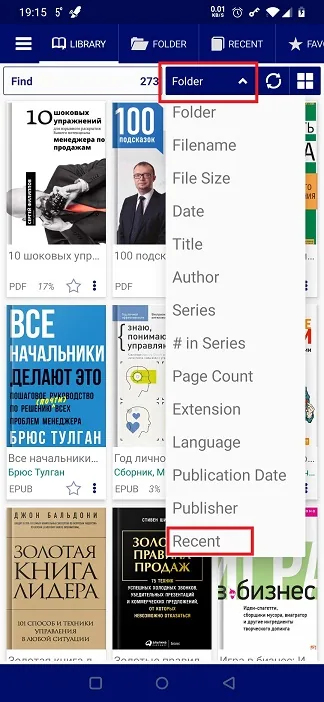

# Sorting Your Library by Latest Reads

> A new sorting criterion has been introduced in **Librera**: By your latest reads.

* Go to the _Library_ tab
* Tap on the current sorting choice to open a dropdown list 
* Select _Recent_

> Those books that you have not opened yet will be left out of the list. The book you're currently reading will by placed on top.

||||
|-|-|-|
|{: loading="lazy"}|{: loading="lazy"}|{: loading="lazy"}|
