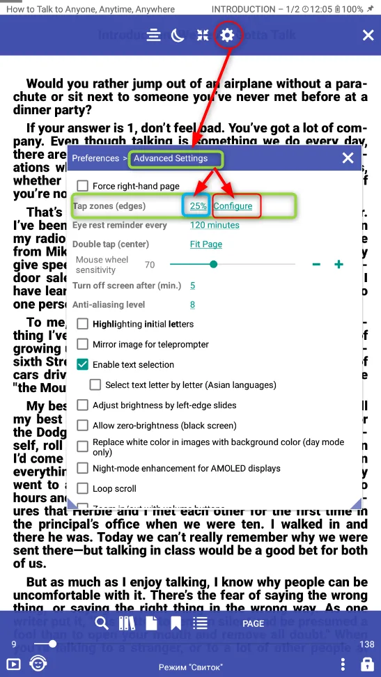
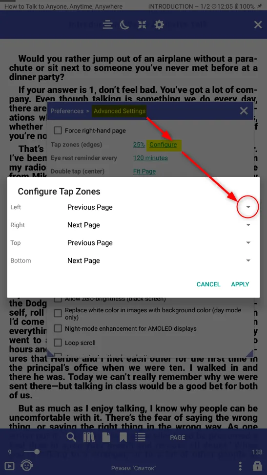
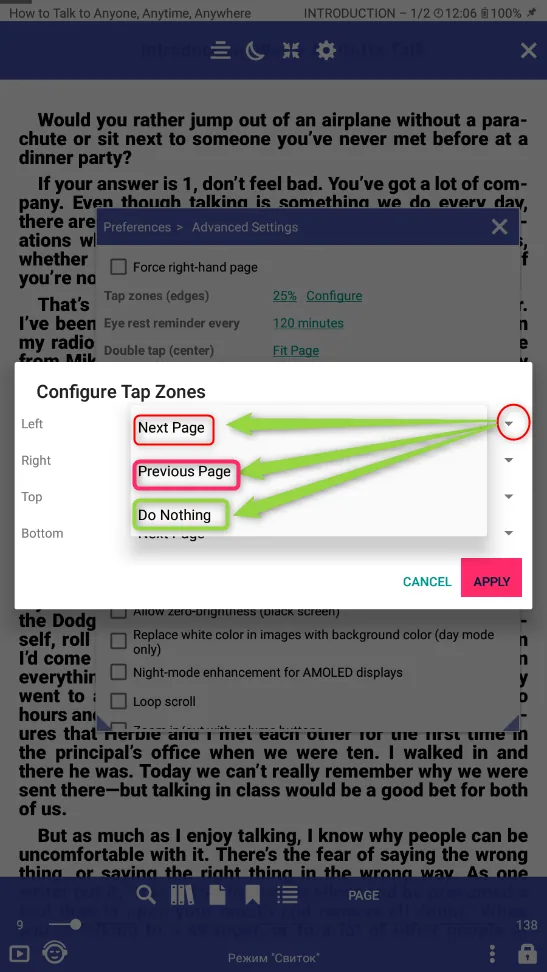
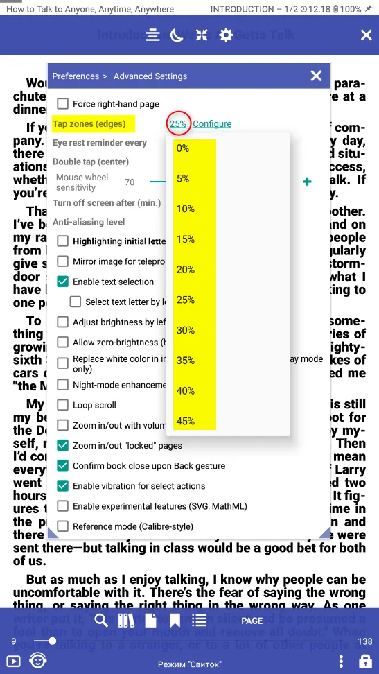
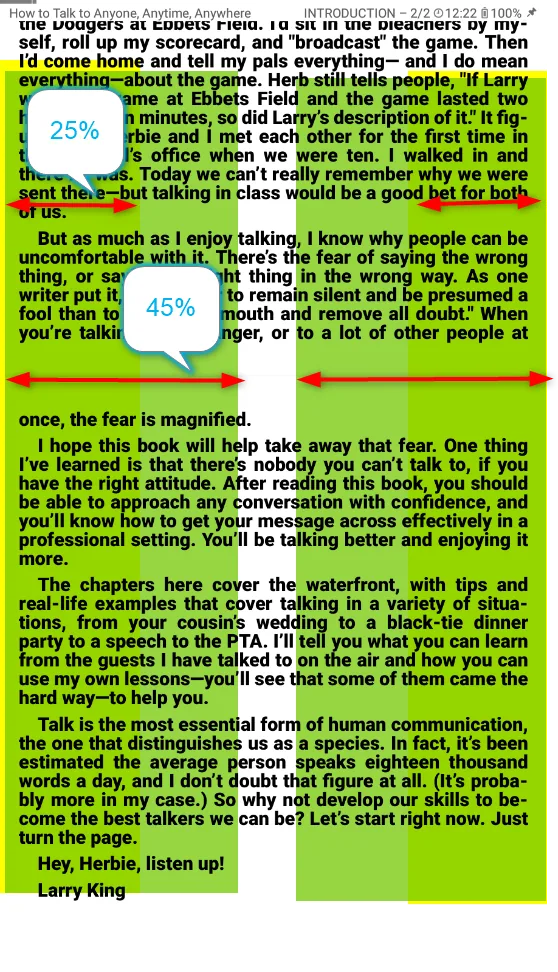

# Configure tab zones size  left/right/top/bottom

> You can configure tab zones(edges) size and places:

||||
|-|-|-|
|{: loading="lazy"}|

In order to configure actions when clicking on a tab zone (texting zone), you need to open **Settings**, 
then go to **Advanced functions**, find the section **Tab zones (texting zones)** and click **setup**. 

In the pop-up window opposite the required tab area, click on the triangle and select the required action. 

After installation, don't forget to press **Apply**

||||
|-|-|-|
|{: loading="lazy"}|{: loading="lazy"}|

In order to configure the tab zones (texting zones) router, you need to open **Settings**.

Then go to **Advanced functions**, find the section **Tab zones (texting zones)** and select the tab zone router

||||
|-|-|-|
|{: loading="lazy"}|{: loading="lazy"}|
