# 7.10

* A major update based on readers' requests and feedback
* New Text-To-Speech (TTS) interface
* Improved support for EPUB 3.0, audio files playback
* Multi-word search queries in all formats, including PDF
* Support for notched smartphones
* The status bar legend now has three options to choose from: full, compact, and chapter-oriented
* More feedback and requests are very welcome!

Subscribe to the __Librera Reader Telegram__ channel [(https://t.me/LibreraReader)](https://t.me/LibreraReader), news, announcements and a lot of interesting about the new functionality.

# What is new in Librera 7.10

The TTS Settings window has gotten a new look and now works better in the background. 
TTS reading supports adjustable pauses (breaks) at punctuation marks. 

* TTS controls at the bottom
* Easy speed change
* Improved notification behavior

||||
|-|-|-|
|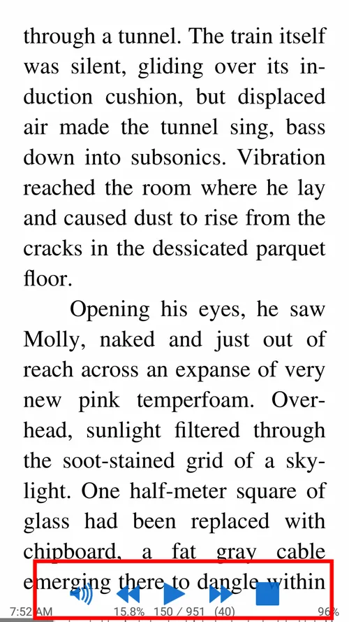{: loading="lazy"}|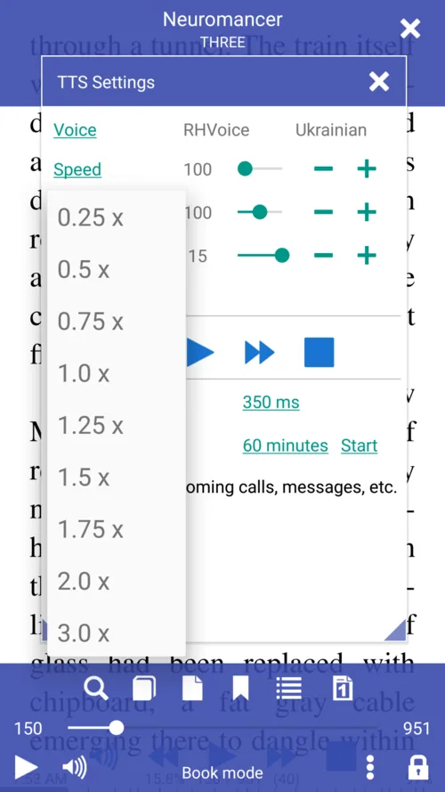{: loading="lazy"}|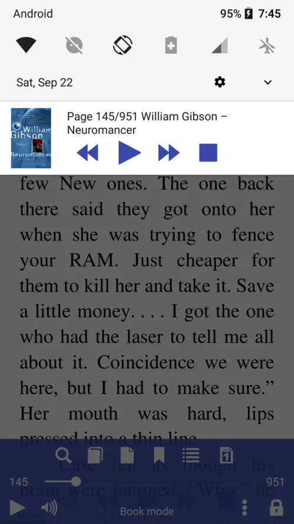{: loading="lazy"}|

Search for multiple words in any book format. 
The "Normalize font size" option makes all fonts the same size (height) and collapses no-break spaces to single spaces.

* Multiple-word search queries in a book
* Disable normalize font size 
* Enable normalize font size

||||
|-|-|-|
|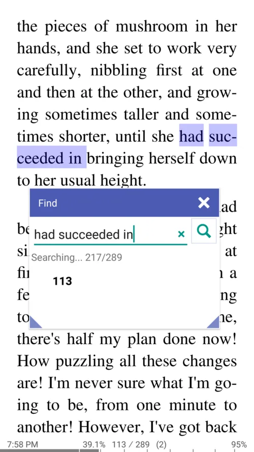{: loading="lazy"}|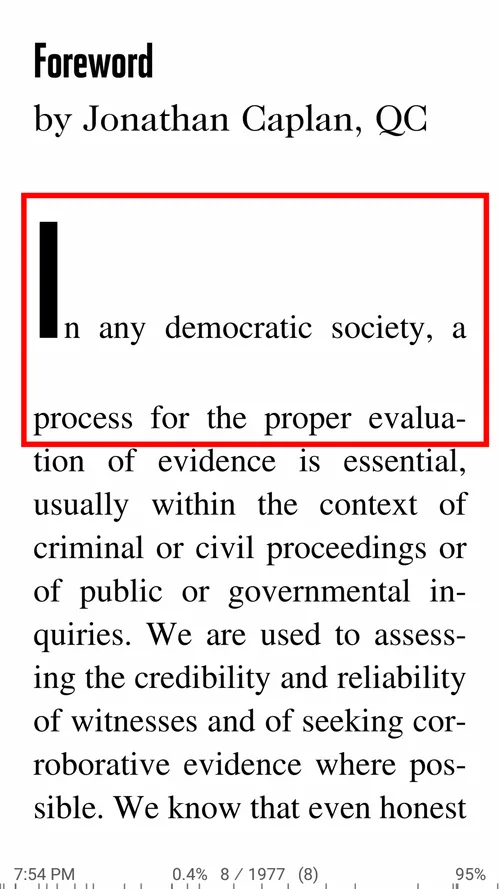{: loading="lazy"}|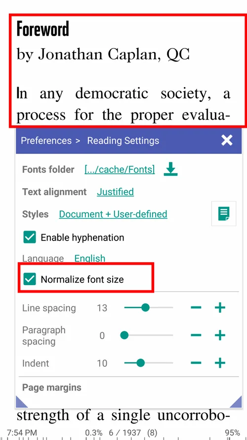{: loading="lazy"}|

Open an external audio file from the TTS Settings dialog and listen to it while reading.
This feature should come in handy for those learning foreign languages or for musicians.
Librera player is also a shot at reading multimedia books.
The format of the status bar legend can be changed from full to compact to chapter-oriented

* Built-in audio player (for playing external MP3, MP4, FLAC audio files while reading a book)
* Play media files in EPUB3 books
* Three status bar legend formats to choose from

||||
|-|-|-|
|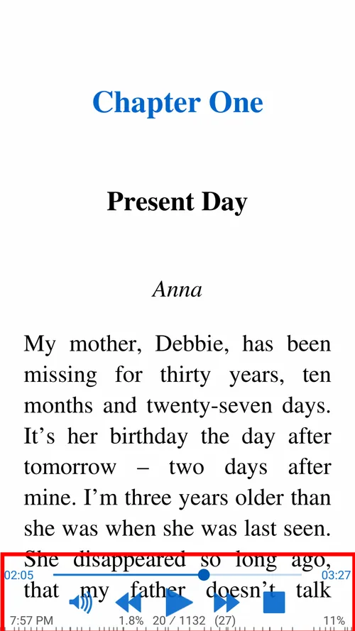{: loading="lazy"}|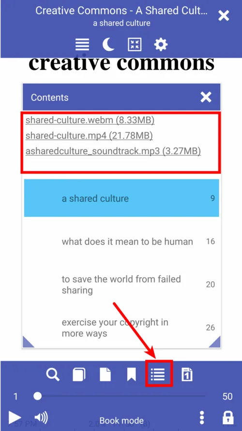{: loading="lazy"}|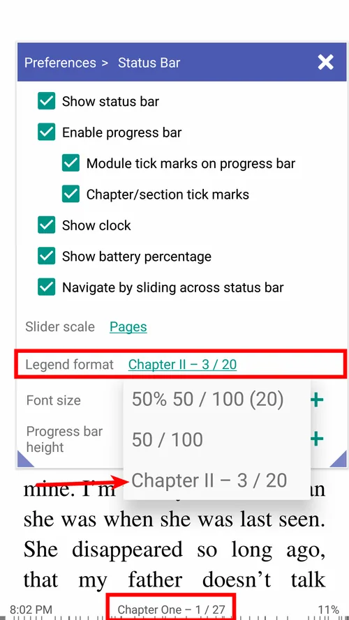{: loading="lazy"}|

 Leading initials in chapters of __FB2__ books can be configured in the Configure Fonts dialog.

* Pop up the Configure Fonts window after opening an FB2 book
* Enable and configure leading initials
* You can change their font, color, size, etc.

||||
|-|-|-|
|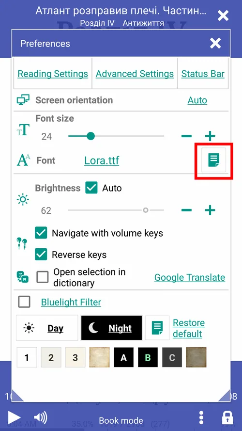{: loading="lazy"}|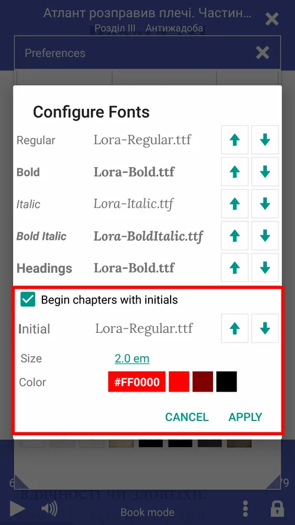{: loading="lazy"}|{: loading="lazy"}|

* Support for phones w/ notched displays
* Table of contents for EPUB 3.0 books
