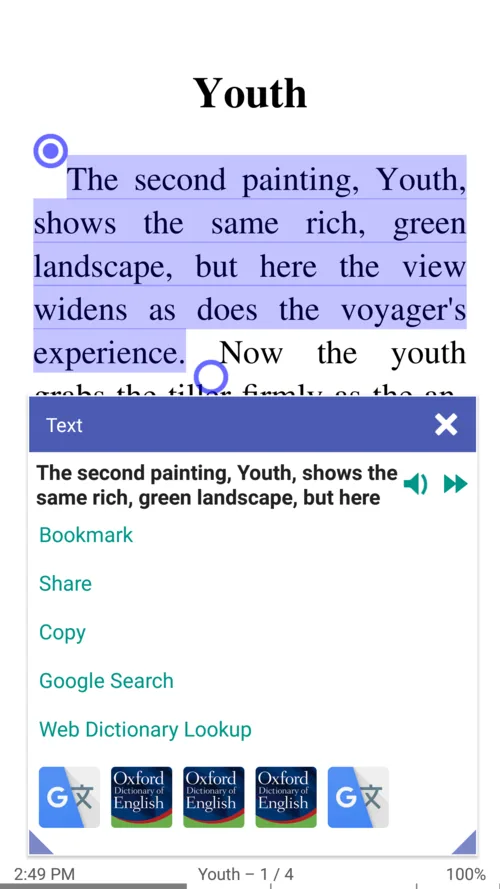
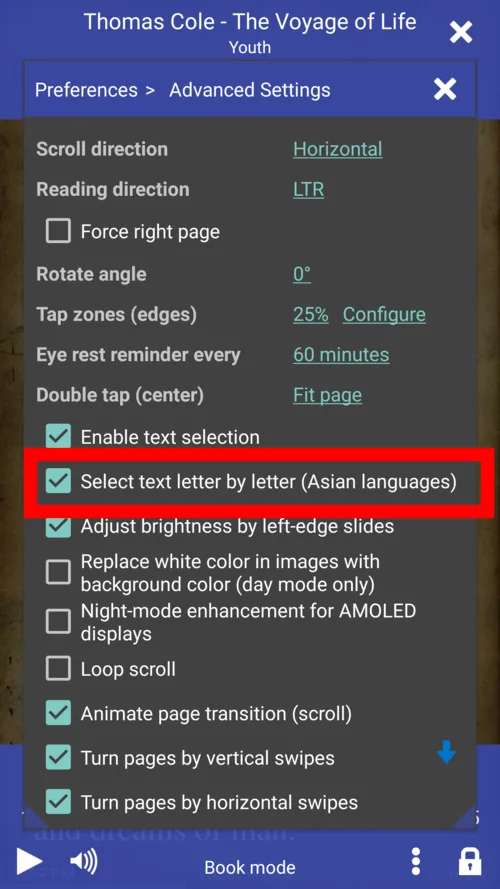
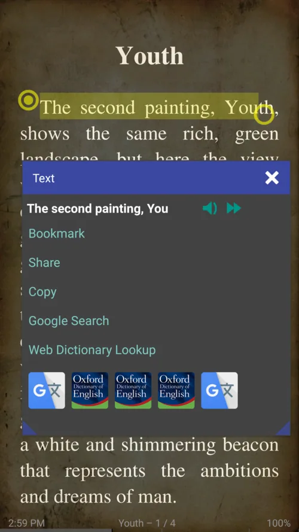
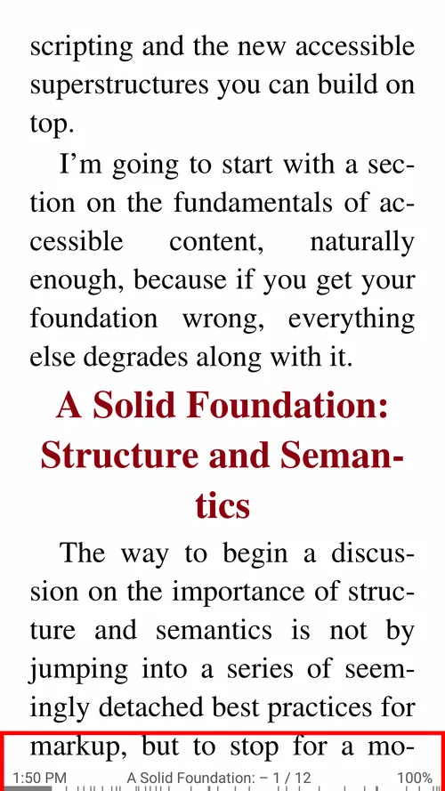
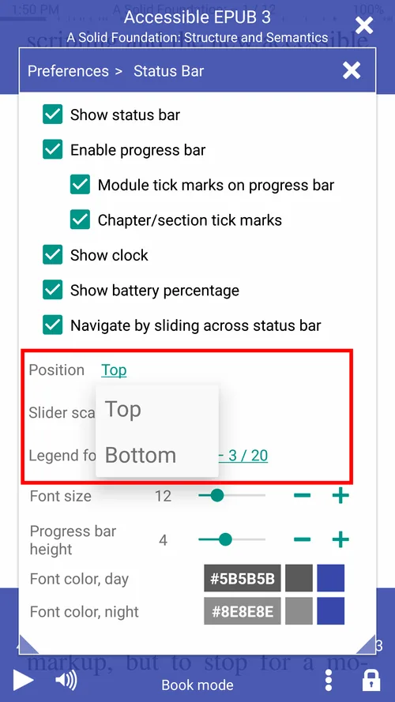
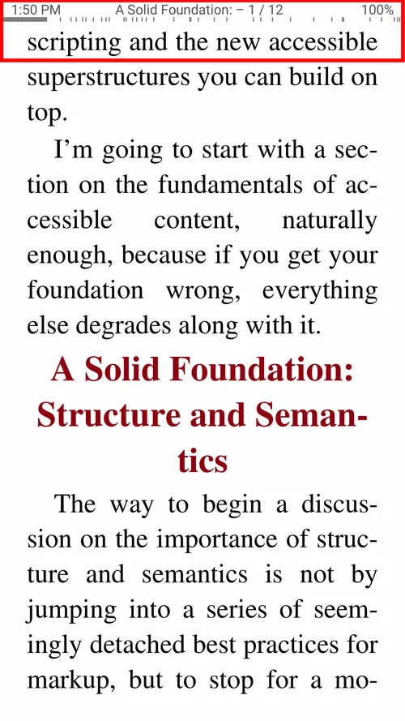
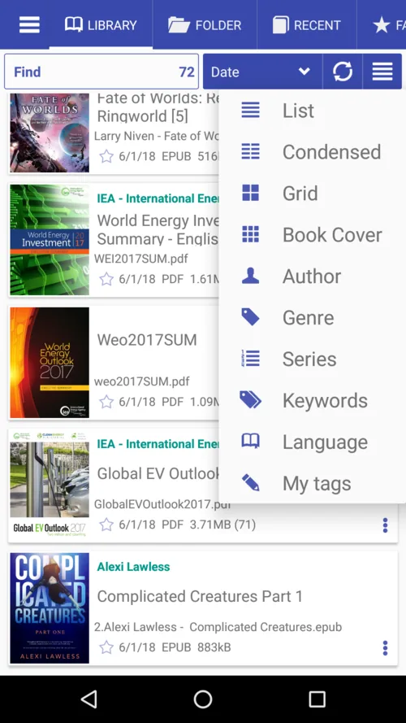
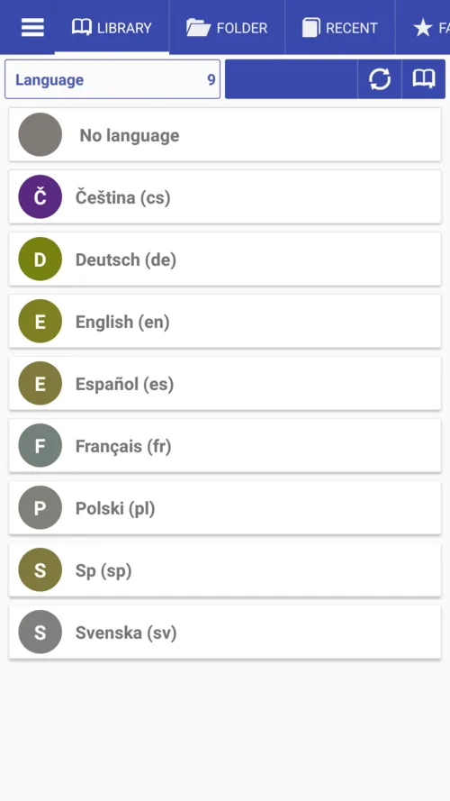
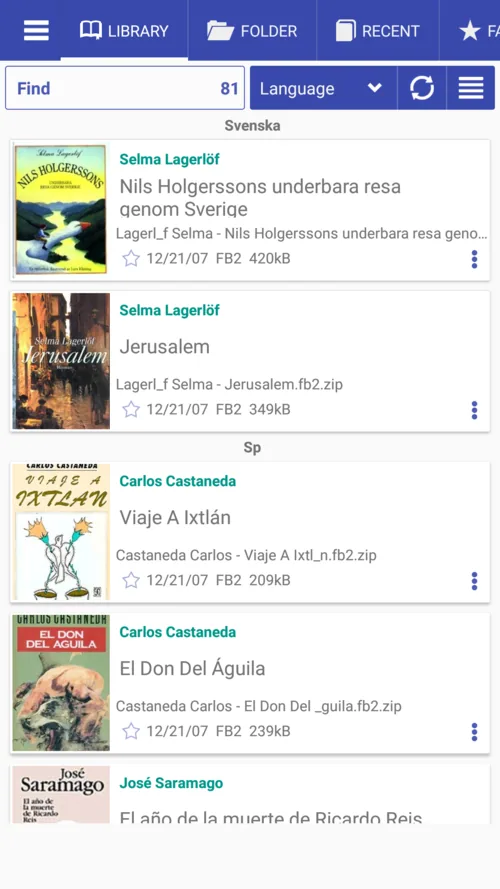

# 7.11

**New Features**

* Selecting text with start and end markers
* RSVP (Rapid Serial Visual Presentation) speed reading mode (w/ a twist!)
* Text selection and search in DjVu documents
* Option to change the status bar position (Top or Bottom) in Book mode
* Bookmarks are now linked to reading progress percentage values
* Now folders can be opened as books
* Sort book Library by Language

**Fixes**

* Cover page generation for large AZW and AZW3 books
* Adaptive application icon in compliance w/ the recent Android 8+ trends
* Hyphenation rules for more languages
* TTS reading will stop if your Bluetooth device gets disconnected

Subscribe to the __Librera Reader__ Telegram channel [https://t.me/LibreraReader](https://t.me/LibreraReader). Be the first to learn about our latest developments, never miss out on the freshest news, announcements, and other interesting stuff regarding Librera's new features and functionality.

**Text Selection Handles**

* If the user selects more than one word, the text selection handles will appear
* Text can be selected in either **letter-by-letter** or **word-by-word** fashion
* Either handle (start or end) can be dragged separately, in real time

||||
|-|-|-|
|{: loading="lazy"}|{: loading="lazy"}|{: loading="lazy"}|

**RSVP (Rapid Serial Visual Presentation) Reading / Speed Reading**

Speed reading with __Librera__ allows you to improve your reading speed to up to 700 words per minute (WPM) implementing the RSVP method.
Please follow the link to find more info on the subject  [Speed reading section](/librera-reader/faq/rsvp-speed-reading-rapid-serial-visual-presentation/)

* The RSVP mode can be launched from the book menu (Speed read)
* Speed read in just one tap
* Adjust minimum line length: up to 30 CPL

||||
|-|-|-|
|{: loading="lazy"}|{: loading="lazy"}|{: loading="lazy"}|

**Status Bar Position (Top or Bottom) in Book Mode**

* The status bar is at bottom by default
* Select its position from the dropdown list
* Status bar on top

||||
|-|-|-|
|{: loading="lazy"}|{: loading="lazy"}|{: loading="lazy"}|

**Open Folder w/ Images as a Book (Bind in a Book)**

To open a folder as a book, navigate to it in the Folders tab and tap on its name. If it holds at least one image file, you will see the Bind in a Book option.

* Open a folder with images and bind them in a book
* Folder w/ images opened as a virtual book 
* Crop white space, adjust contrast and brightness, etc.

||||
|-|-|-|
|{: loading="lazy"}|{: loading="lazy"}|{: loading="lazy"}|

**Sort books by Language**

* See all languages available in the Library
* Sort books by Languages

||||
|-|-|-|
|{: loading="lazy"}|{: loading="lazy"}|{: loading="lazy"}|
