# 7.12

**New Features**

* Playlists (book groupings)
* Add apps (dictionaries) to open selected text in the Text window 
* Play back mp3 files and folders
* Handle book series
* Option to display end-/footnotes as in-text notes
* TTS can now read end-/footnotes
* Option to resume TTS reading at the last punctuation mark (per-sentence mode)
* Share pages from other apps (e.g., browsers) w/ Librera Reader
* Support for Chinese Traditional and Simplified 
* Bookmarks Ribbon for on-the-fly bookmarking (e.g., in Musician's mode)
* File manager: copy, paste, and move files

**Bookmarks Ribbon**

* Add bookmarks w/ a single tap
* Easily navigate bookmarks
* Show/hide the ribbon in reading modes

||||
|-|-|-|
|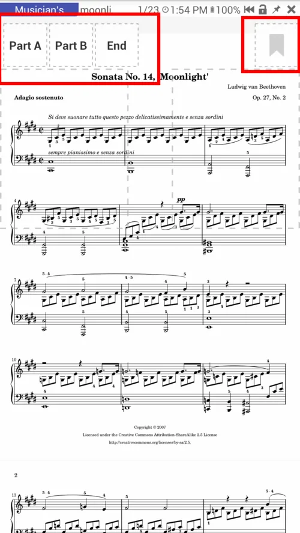{: loading="lazy"}|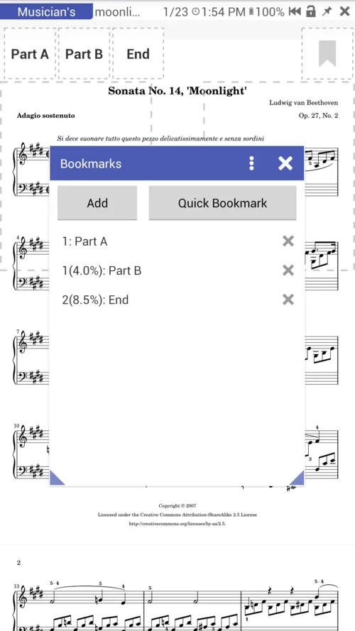{: loading="lazy"}|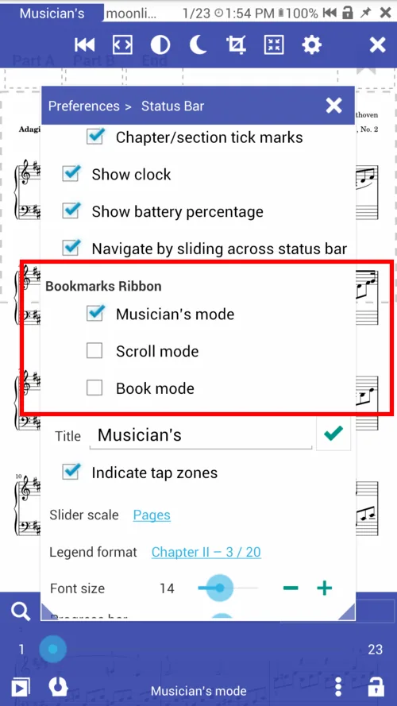{: loading="lazy"}|

**Copy, paste, move files in the file manager**

* Copy any book with a book menu
* Paster or move book to the folder
* Click on the folder path or on the black space

||||
|-|-|-|
|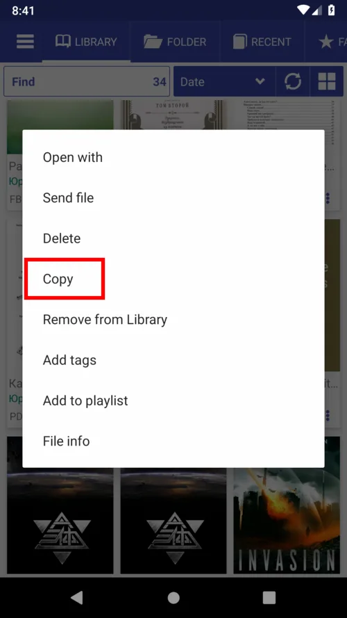{: loading="lazy"}|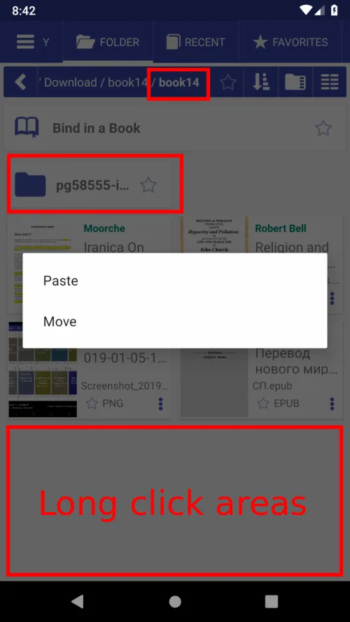{: loading="lazy"}|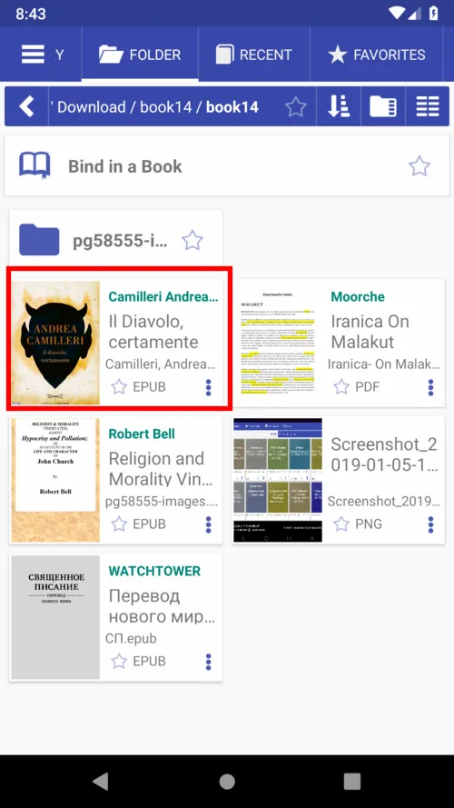{: loading="lazy"}|

**Favorites Tab**

The **Favorites** tab has been redesigned. The **Tags** and **Playlists** items can now be easily accessed.
Tag books to group them by whatever common criterion, e.g., "Math," "Thriller," "Mystery," etc. (A tag can be also added from the Book Info window.)
Playlists are intended mostly for musicians: it's easy to keep selected documents handy and manipulate the list.

||||
|-|-|-|
|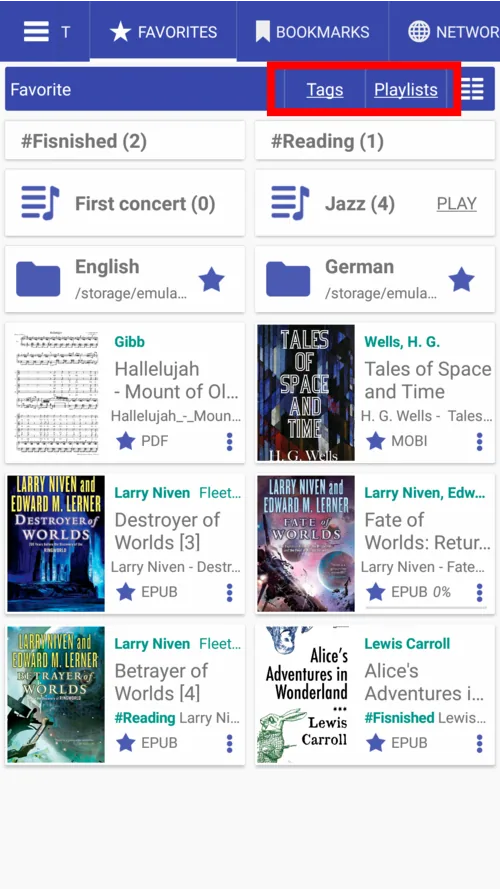{: loading="lazy"}|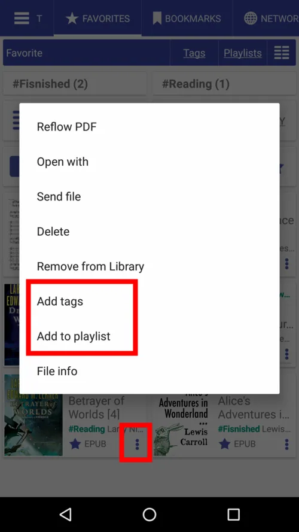{: loading="lazy"}||

**Playlists**

* Create playlists
* Drag by handles to change the book order
* Swipe right/left to remove a book from the list
* Tap Edit to make changes to the list.

||||
|-|-|-|
|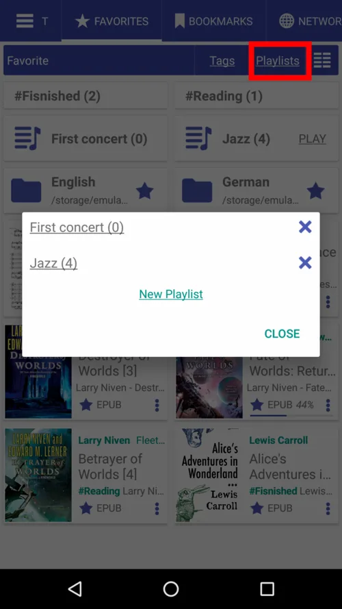{: loading="lazy"}|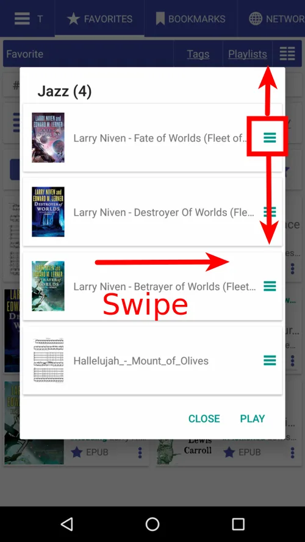{: loading="lazy"}|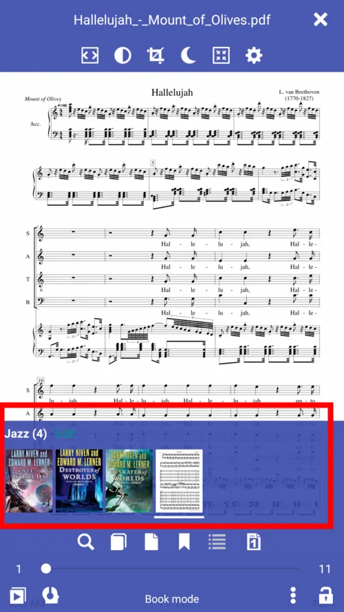{: loading="lazy"}|

**Add User Apps**

Tap **+** to add an app that will open selected text

||||
|-|-|-|
|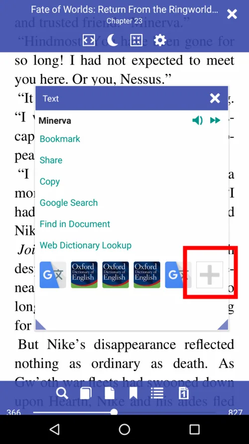{: loading="lazy"}|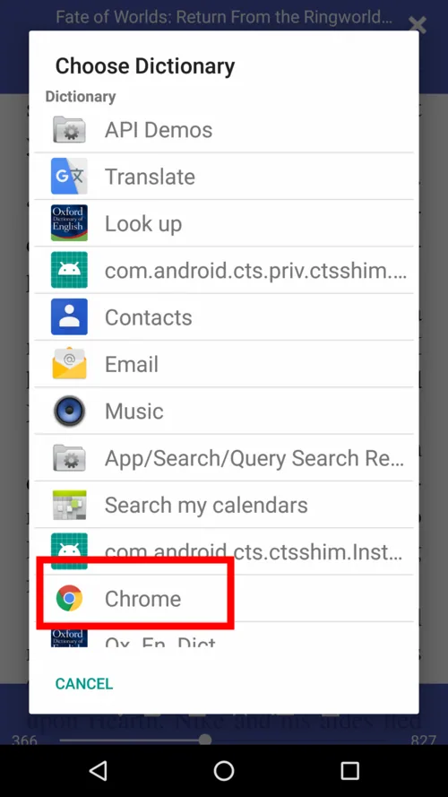{: loading="lazy"}|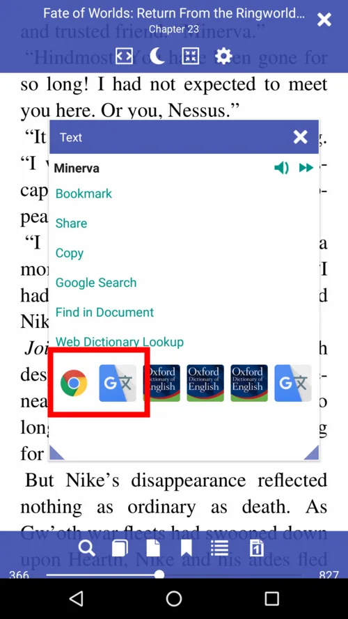{: loading="lazy"}|

**Handling Book Series**

It is easy to find all books in a series:

* Series are "clickable" in the book card
* Apply the Series filter to the book library
* All books in the series will be listed in the Book Info window.

||||
|-|-|-|
|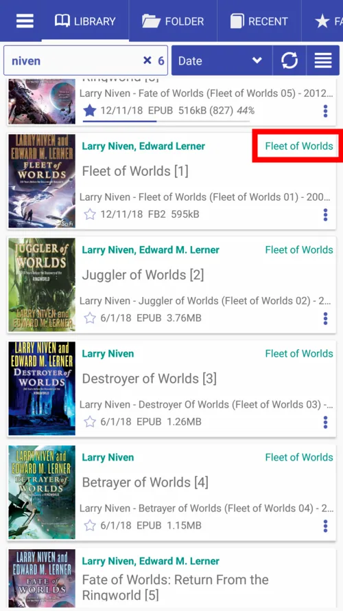{: loading="lazy"}|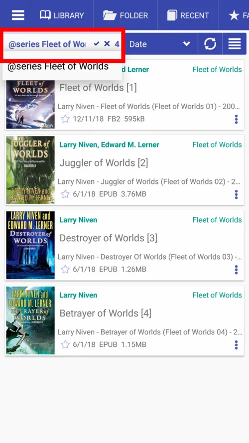{: loading="lazy"}|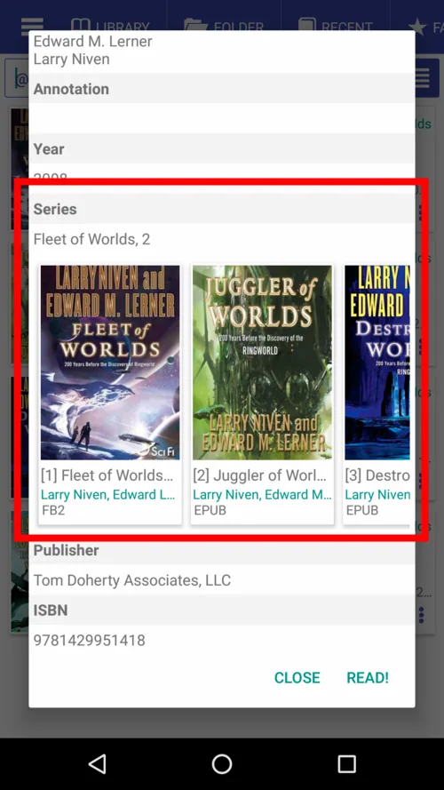{: loading="lazy"}|

**Play mp3 Files**

Listen to an mp3 file or file selection via the internal player in parallel with book reading.
Could be useful for musicians and for those who study foreign languages.

||||
|-|-|-|
|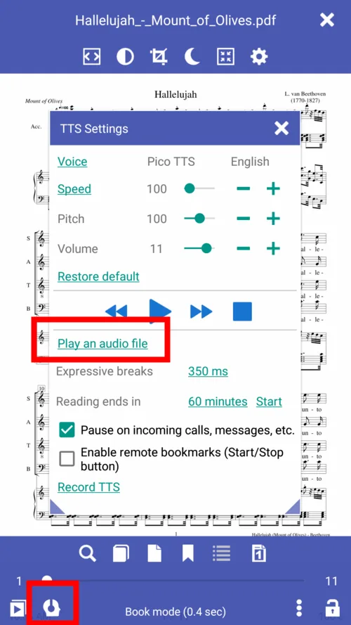{: loading="lazy"}|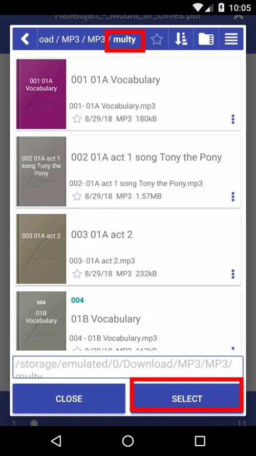{: loading="lazy"}|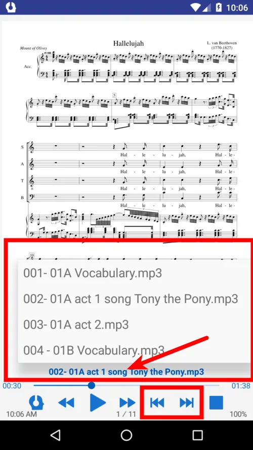{: loading="lazy"}|
