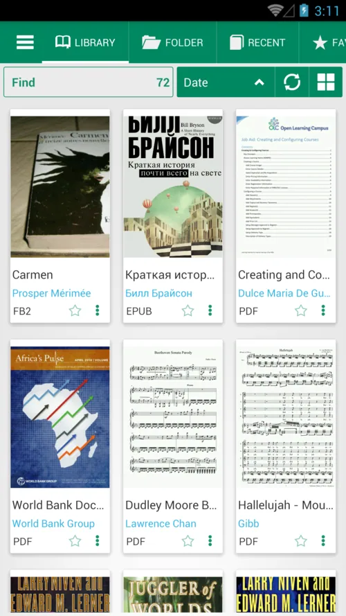
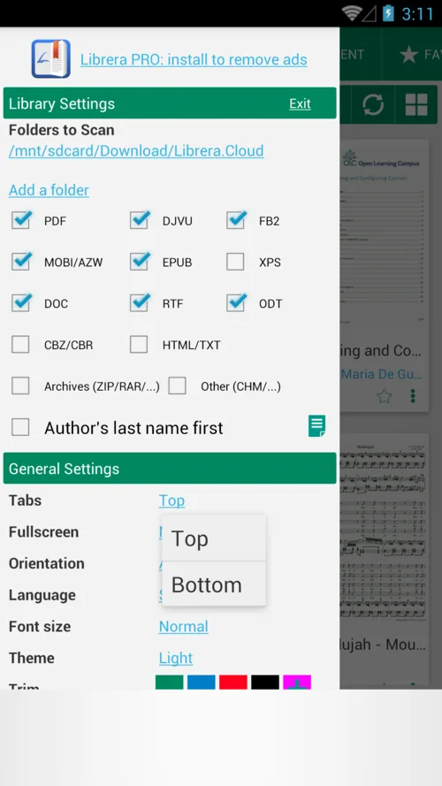
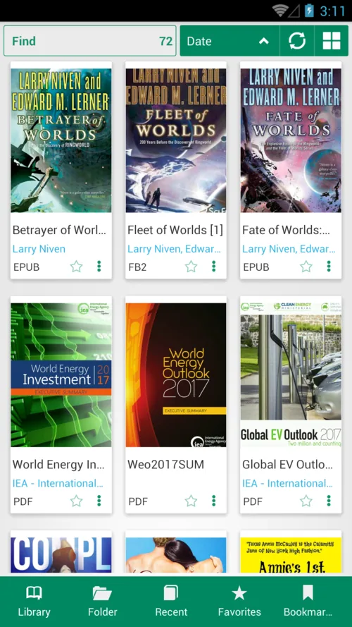
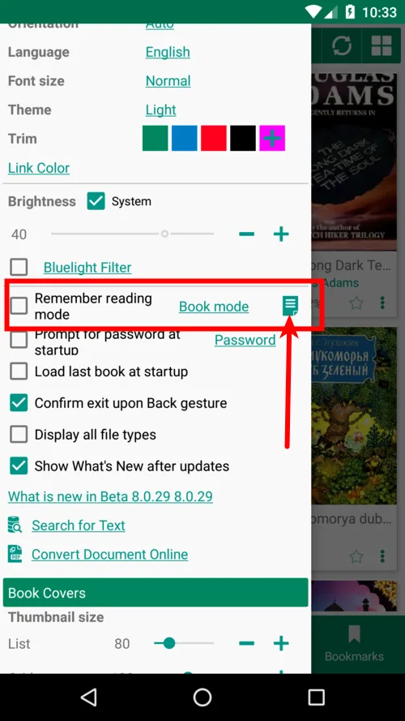
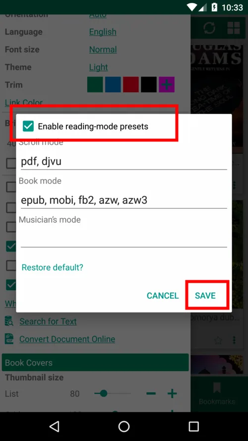
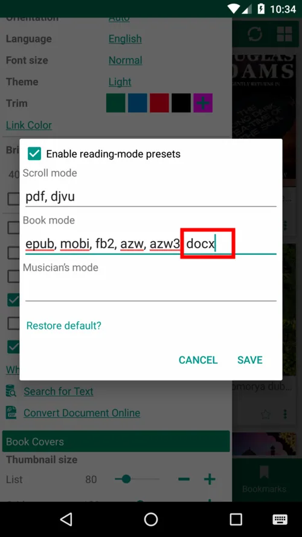
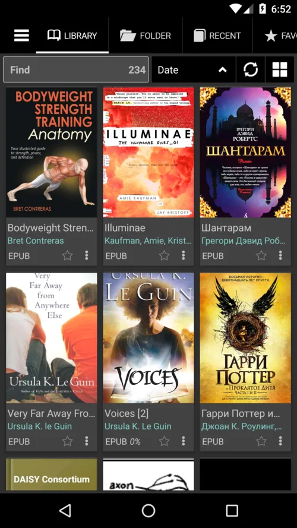
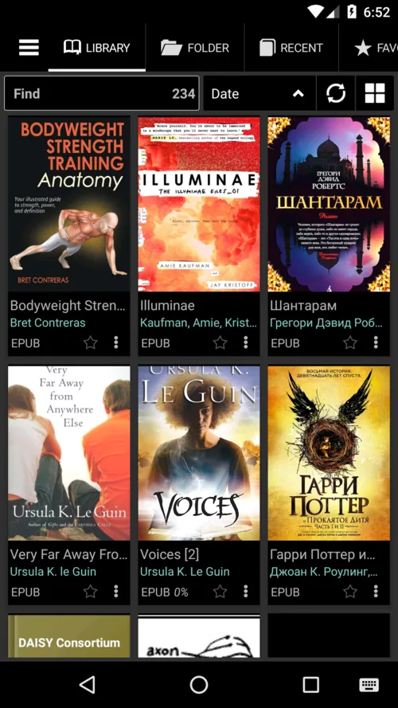
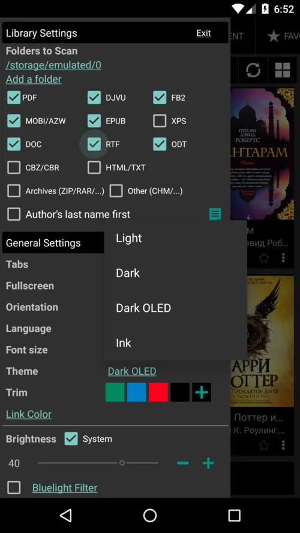

# 8.0

By using this app you agree to the terms of the [Privacy Policy](/librera-reader/privacy-policy/)

**General Improvements**

* All libraries have been updated
* Dark theme has been improved

**New Features**

* Option to change Tabs position
* Doc format support
* Docx format support on Android 8+ devices
* Reading-mode presets

**Bug Fixes**

* Deleted files and folders no longer _ghost_ Library
* Files opened from other apps will stay in Library until deleted (and cache cleared)

**Choose Tabs Position: Top or Bottom**

||||
|-|-|-|
|{: loading="lazy"}|{: loading="lazy"}|{: loading="lazy"}|

**Reading-mode presets**

* Tell **Librera** which default reading mode you prefer for a particular book format
* Manually add any desired format

||||
|-|-|-|
|{: loading="lazy"}|{: loading="lazy"}|{: loading="lazy"}|

**Dark & Dark OLED Themes**

* Choose Dark OLED theme with pitch-black color

||||
|-|-|-|
|{: loading="lazy"}|{: loading="lazy"}|{: loading="lazy"}|
